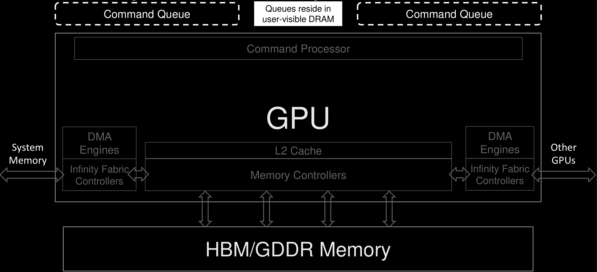
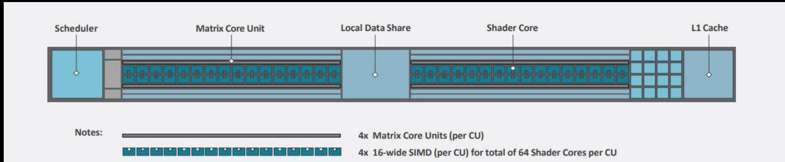

# Table of Contents

- [CDNA2 Memory Hierarchy](#cdna2-memory-hierarchy)
- [A Team Effort](#a-team-effort)
- [Agenda](#agenda)
- [AMD CDNA2 GPU Hardware Layout](#amd-cdna2-gpu-hardware-layout)
- [AMD CDNA2 GPU Hardware Layout](#amd-cdna2-gpu-hardware-layout)
- [The CDNA2 Compute Unit (CU)](#the-cdna2-compute-unit-cu)
- [Compute Unit (CU)](#compute-unit-cu)
- [The CDNA2 Compute Unit (CU) – Scalar Unit](#the-cdna2-compute-unit-cu-scalar-unit)
- [The CDNA2 Compute Unit (CU) – Vector ALU](#the-cdna2-compute-unit-cu-vector-alu)
- [The CDNA2 Compute Unit (CU) – Matrix Cores](#the-cdna2-compute-unit-cu-matrix-cores)
- [The CDNA2 Compute Unit (CU) – Vector Memory Unit](#the-cdna2-compute-unit-cu-vector-memory-unit)
- [The CDNA2 Compute Unit (CU) - LDS](#the-cdna2-compute-unit-cu-lds)
- [The CDNA2 Compute Unit (CU) - Scheduler](#the-cdna2-compute-unit-cu-scheduler)
- [The CDNA2 Compute Unit (CU) - Scheduler](#the-cdna2-compute-unit-cu-scheduler)
- [GPU Occupancy on CDNA2](#gpu-occupancy-on-cdna2)
- [What is Occupancy?](#what-is-occupancy)
- [Occupancy: Limiting Factors](#occupancy-limiting-factors)
- [Occupancy: Limiting Factors - VGPRs](#occupancy-limiting-factors-vgprs)
- [Occupancy: Limiting Factors - SGPRs](#occupancy-limiting-factors-sgprs)
- [Occupancy: Register Spilling](#occupancy-register-spilling)
- [Occupancy: Limiting Factors - LDS](#occupancy-limiting-factors-lds)
- [Example: batched matrix-vector multiply](#example-batched-matrix-vector-multiply)
- [Example: batched matrix-vector multiply](#example-batched-matrix-vector-multiply)
- [Example occupancy calculation](#example-occupancy-calculation)
- [Example occupancy calculation](#example-occupancy-calculation)
- [Example occupancy calculation](#example-occupancy-calculation)
- [Example occupancy calculation](#example-occupancy-calculation)
- [Example occupancy calculation](#example-occupancy-calculation)
- [Wrap Up](#wrap-up)
- [DISCLAIMERS AND ATTRIBUTIONS](#disclaimers-and-attributions)
- [AMD](#amd)

---

<!-- Page 1 -->

# CDNA2 Memory Hierarchy

Alessandro Fanfarillo

---

<!-- Page 2 -->

# A Team Effort

Thanks to all former contributors to this presentation:

Paul Bauman

Noel Chalmers

Nicholas Curtis

Chip Freitag

Joseph Greathouse

Nicholas Malaya

Damon McDougall

Scott Moe

René van Oostrum

Noah Wolfe

---

<!-- Page 3 -->

# Agenda

- Introduction to CDNA2 Compute Unit architecture

- Memory hierarchy in CDNA2 Compute Units

- Occupancy considerations with examples

---

<!-- Page 4 -->

# AMD CDNA2 GPU Hardware Layout

Command Queue

Queues reside in user-visible DRAM

Command Queue

Command Processor

Shader Engine (SE0)

Shader Engine (SE1)

Shader Engine (SE3)

Shader Engine (SE2)

---

<!-- Page 5 -->

# AMD CDNA2 GPU Hardware Layout

Command Queue

Queues reside in user-visible DRAM

Command Queue

Command Processor

<table><tr><td>CU</td><td>CU</td></tr><tr><td>CU</td><td>CU</td></tr><tr><td>CU</td><td>CU</td></tr><tr><td>CU</td><td>CU</td></tr><tr><td>CU</td><td>CU</td></tr><tr><td>CU</td><td>CU</td></tr><tr><td>CU</td><td>CU</td></tr><tr><td>CU</td><td>CU</td></tr></table>

workload manager

<table><tr><td>CU</td><td>CU</td></tr><tr><td>CU</td><td>CU</td></tr><tr><td>CU</td><td>CU</td></tr><tr><td>CU</td><td>CU</td></tr><tr><td>CU</td><td>CU</td></tr><tr><td>CU</td><td>CU</td></tr><tr><td>CU</td><td>CU</td></tr><tr><td>CU</td><td>CU</td></tr></table>

L2

<table><tr><td>CU</td><td>CU</td></tr><tr><td>CU</td><td>CU</td></tr><tr><td>CU</td><td>CU</td></tr><tr><td>CU</td><td>CU</td></tr><tr><td>CU</td><td>CU</td></tr><tr><td>CU</td><td>CU</td></tr><tr><td>CU</td><td>CU</td></tr><tr><td>CU</td><td>CU</td></tr></table>

workload manager

<table><tr><td>CU</td><td>CU</td></tr><tr><td>CU</td><td>CU</td></tr><tr><td>CU</td><td>CU</td></tr><tr><td>CU</td><td>CU</td></tr><tr><td>CU</td><td>CU</td></tr><tr><td>CU</td><td>CU</td></tr><tr><td>CU</td><td>CU</td></tr><tr><td>CU</td><td>CU</td></tr></table>

workload manager

---

<!-- Page 6 -->

[Public]

GPU Memory, I/O, and Connectivity

---

<!-- Page 7 -->

# The CDNA2 Compute Unit (CU)

# Compute Unit (CU)

- The command processor sends work packages (i.e. workgroups of work-items in HIP) to the Compute Units (CUs)

Workgroups are executed in wavefronts (groups of 64 work-items on a SIMD)

All wavefronts in a workgroup reside on the same CU

The CU's scheduler can hold wavefronts from many workgroups

At most 32 wavefronts total per CU (8 per SIMD)

---

<!-- Page 8 -->

# The CDNA2 Compute Unit (CU) – Scalar Unit

sL1d Cache

Scalar Unit

SGPR

- Scalar Unit (SU)

- Shared by all work-items in each wavefront, accessed on a per-wavefront level

- Work-items in a wavefront performing the exact same operation can offload this instruction to the SU

- Used for control flow, pointer arithmetic, dispatch a common constant value, etc. Only INT32 capability, no FP

- SU connected to read/write sL1d cache of 16 KiB (not really into the CU but directly attached)

- Has its own pool of Scalar General-Purpose Register (SGPR) file, 12.5KiB per CU, 800 per SIMD

- Maximum of 102 SGPRs / wavefront allocated in groups of 16

---

<!-- Page 9 -->

# The CDNA2 Compute Unit (CU) – Vector ALU

<table><tr><td>sL1d Cache</td><td>SIMD0</td><td>SIMD1</td><td>SIMD2</td><td>SIMD3</td></tr><tr><td>Scalar Unit</td><td>VGPR</td><td>VGPR</td><td>VGPR</td><td>VGPR</td></tr><tr><td>SGPR</td><td></td><td></td><td></td><td></td></tr></table>

- SIMD Units / Execution Units (EU) / VALU

4x SIMD vector units (each 16 lanes wide)

- Each SIMD performs vector logical, integer, FP16, FP32, FP64 operations. FMAs for FP16, FP32, FP64. MFMAAs for FP16, BF16, FP32, FP64. Packed FP16 and FP32.

- Two pools of Vector General-Purpose Registers (VGPRs): regular VGPRs and Accumulation VGPRs (AccVGPRs)

- Maximum of 512 registers per SIMD – each register is 64x 4-byte entries. For 64 bits operations 2 contiguous registers need to be used.

- A wavefront can use up to 256 VGPRs (and 256 AccVGPRs)

- Instruction buffer for 8 wavefronts on each SIMD unit. Each wavefront is local to a single SIMD unit, not spread among the four

---

<!-- Page 10 -->

# The CDNA2 Compute Unit (CU) – Matrix Cores

- Matrix Fused Multiply Add (MFMA) instructions operate on a per-wavefront basis rather than on a per-thread basis

- For more info about MFMA instructions and register usage check out the AMD Matrix Instruction Calculator: https://github.com/RadeonOpenCompute/amd_matrix_instruction_calculator

- Matrix Cores leveraged is several ways:

Libraries: rocBLAS, rocWMMA

- Use compiler intrinsics

- HIP kernels with inline assembly

- Write kernels completely in assembly…

- More details on how to use MFMA instructions: https://gpuopen.com/learn/amd-lab-notes/amd-lab-notes-matrix-cores-readme

---

<!-- Page 11 -->

# The CDNA2 Compute Unit (CU) – Vector Memory Unit

Vector Memory Unit

Vector memory operations from all 4 SIMD units are routed to the Vector Memory Unit (VMEM)

Can handle uncoalesced memory addresses

Connects to a 16 KiB L1 Data Cache (vL1d). Cache lines of 64 bytes (L2 cache line is 128 bytes).

Write-through

vL1d cache not really into the CU but directly connected to it

None

---

<!-- Page 12 -->

# The CDNA2 Compute Unit (CU) - LDS

64 KB Local Data Share (LDS, or shared memory)

32 banks with conflict resolution

Can share data between all work-items in a workgroup

It supports various HW atomic operations for integer, logical, and floating-point data types.

None

---

<!-- Page 13 -->

# The CDNA2 Compute Unit (CU) - Scheduler

- Scheduler

- Buffer for up to 32 wavefronts

- Separate decode/issue for

- VALU, VGPR load/store

- SALU, SGPR load/store

- LDS load/store

- Global mem load/store

- Special instructions (NoOps, barriers, branch instructions)

---

<!-- Page 14 -->

# The CDNA2 Compute Unit (CU) - Scheduler

- Scheduler

- At each clock, waves on 1 SIMD unit are considered for execution (Round Robin scheduling among SIMDs)

- At most 1 instruction per wavefront may be issued

- At most 1 instruction from each category may be issued (VALU, VMEM, SALU/SMEM, LDS, branch)

- Maximum of 5 instructions issued to wavefronts on a single SIMD, per cycle per CU

- VALU instructions take a multiple of four cycles to retire

- e.g. FP32 FMA: cycle 0 – lanes 0-15 | cycle 1 – lanes 16-31 | cycle 2 – lanes 32-47 | cycle 3 – lanes 48-63

- Programmer can still ‘pretend’ CU operates in 64-wide SIMD: 64 FP32 FMA ops / cycle / CU

---

<!-- Page 15 -->

# GPU Occupancy on CDNA2

AMD

---

<!-- Page 16 -->

# What is Occupancy?

Occupancy: the ratio of active wavefronts executing on the GPU to the maximum number of possible wavefronts supported by the hardware.

- Occupancy is controlled by the utilization of resources on a CU

- Can indicate over/under utilization of resources, limiting performance

Different “flavors” of occupancy available:

→ Achieved occupancy is measured on the hardware and is a time-dependent metric (as the number of active wavefronts is not constant)

→ Theoretical occupancy is a calculated metric, derived from the resources requested by the kernel. Compiler can provide this information

→ In addition, occupancy may be reported per-SIMD/EU, per-CU, or per-GPU

To see why occupancy is important, we will consider a batch matrix-vector multiply kernel.

---

<!-- Page 17 -->

# Occupancy: Limiting Factors

Number of wavefronts: max 8 per SIMD, 32 per CU

- Register usage is a big limiting factor to occupancy. Both SGPRs and VGPRTs play a role

- LDS usage is another limiting factor

- Number of wavefronts per workgroup (AKA thread block): max 16 (i.e., max 1024 threads per workgroup).

- Note that all wavefronts of a workgroup are required to be scheduled on the same CU, but not necessarily on the same SIMD of the CU.

---

<!-- Page 18 -->

# Occupancy: Limiting Factors - VGPRs

Vector registers:

- Total of 64x 512 registers available per SIMD (256 VGPRs + 256 AccVGPRs)

- Each wavefront can use up to 256 VGPRs, if more are needed “spilling” to global memory (cacheable)

<table><tr><td>Num VGPRs</td><td>Occupancy per EU</td><td>Occupancy per CU</td></tr><tr><td>≤= 64</td><td>8 waves</td><td>32 waves</td></tr><tr><td>≤= 72</td><td>7 waves</td><td>28 waves</td></tr><tr><td>≤= 80</td><td>6 waves</td><td>24 waves</td></tr><tr><td>≤= 96</td><td>5 waves</td><td>20 waves</td></tr><tr><td>≤= 128</td><td>4 waves</td><td>16 waves</td></tr><tr><td>≤= 168</td><td>3 waves</td><td>12 waves</td></tr><tr><td>≤= 256</td><td>2 waves</td><td>8 waves</td></tr><tr><td>&gt; 256 (+ spilling to AVGPRs/scratch)</td><td>1 waves</td><td>4 waves</td></tr></table>

---

<!-- Page 19 -->

# Occupancy: Limiting Factors - SGPRs

- Scalar registers:

- Total scalar register file size: 12.5 KB (3,200 registers, 800 per SIMD)

- A single wavefront can allocate up to 112 scalar registers in batches of 16

- The last 6 of these are used for special purposes (such as VCC), and these cannot be used as general purpose scalar registers by user code

- The 112 case is special; here, 4 additional registers cannot be used, leaving 102 for GPR purposes

- For each wavefront, 16 additional registers are allocated for a trap handler

- Assuming no register spilling from SGPRs to VGPRTs is performed by the compiler and that the number of VGPRTs is low enough to allow max occupancy, occupancy will be 8 per SIMD up to 100 SGPRs

- When SGPRs usage > 100 occupancy will drop down to 7 wavefronts per SIMD

---

<!-- Page 20 -->

# Occupancy: Register Spilling

- SGPRs

Not observed to be a common source of spilling

- Spilled to vector registers (VGPRs)

- VGPRs

- Spilled to AGPRs, then L2 (L1 is write-through), and finally to HBM

- A wavefront can use directly up to 256 VGPRs. It can spill to up to 256 AVGPRs (assuming no MFMA instructions are used)

- __launch_bounds__(MAX_THREADS_PER_BLOCK, MIN_WARPS_PER_EU)

- A function attribute that must be attached to a global device function

- Provides hints for compiler to manage/reduce register usage per kernel

- MAX_THREADS_PER_BLOCK: guarantees launch size to compiler

- MIN_WARPS_PER_EU: asks compiler to minimize register usage to allow at least x-many warps to be active per SIMD unit/EU

---

<!-- Page 21 -->

# Occupancy: Limiting Factors - LDS

- Local Data Share:

- Note that for occupancy calculations, we need to look at the usage per workgroup, not per wavefront

- 64 KB per Compute Unit

---

<!-- Page 22 -->

# Example: batched matrix-vector multiply

As a test-bed for our occupancy calculations, we will use a batched matrix-vector multiplication kernel:

- $\bar{A}$ is a $(\mathrm{N}_\mathrm{m} \times \mathrm{N}_\mathrm{m})$ matrix

- $\vec{x}$ and $\vec{b}$ are $\mathrm{N}_\nu$ vectors each of size $(\mathrm{N}_\mathrm{m} \times 1)$

$$\mathrm {A} \cdot \mathrm {X} = \mathrm {b}$$

---

<!-- Page 23 -->

# Example: batched matrix-vector multiply

Main implementation ideas:

Every work-item multiplies $\bar{A}$ with multiple vectors from $\vec{x}$.

The data of a vector from $\vec{x}$ is reused $\mathrm{N}_m$ times.

Instead of loading a vector from $\vec{x}$ from HBM for every use, we preload a batch of WG-size * $\mathrm{N}_b$ of them in (faster) LDS, and use them repeatedly from there.

$$\mathbf {A} \cdot \mathbf {X} = \mathbf {b}$$

---

<!-- Page 24 -->

# Example occupancy calculation

<table><tr><td>Parameter</td><td>Value</td></tr><tr><td>WG-size</td><td>128</td></tr><tr><td>Nm</td><td>4</td></tr><tr><td>Nb</td><td>32</td></tr><tr><td>Nv</td><td>3.35E+08</td></tr></table>

Kernel configuration V0

Resulting performance ~55 GFLOP/s, very poor! Why?

One reason: using too much LDS per work-group!

mxv.cpp:44:1: remark: SGPRs: 22 [-Rpass-analysis=kernel-resource-usage]

mxv.cpp:44:1: remark: VGPRs: 74 [-Rpass-analysis=kernel-resource-usage]

mxv.cpp:44:1: remark: AGPRs: 0 [-Rpass-analysis=kernel-resource-usage]

mxv.cpp:44:1: remark: ScratchSize [bytes/lane]: 0 [-Rpass-analysis=kernel-resource-usage]

mxv.cpp:44:1: remark: Occupancy [waves/SIMD]: 1 [-Rpass-analysis=kernel-resource-usage]

mxv.cpp:44:1: remark: SGPRs Spill: 0 [-Rpass-analysis=kernel-resource-usage]

mxv.cpp:44:1: remark: VGPRs Spill: 0 [-Rpass-analysis=kernel-resource-usage]

mxv.cpp:44:1: remark: LDS Size [bytes/block]: 65536 [-Rpass-analysis=kernel-resource-usage]

$$\begin{array}{l} \text {L D S} = \text {W G} _ {\text {s i z e}} \times \text {N} _ {\text {b}} \times \text {N} _ {\text {m}} \times \text {s i z e o f} (\text {f l o a t}) \\ = 1 2 8 \times 3 2 \times 4 \times 4 \text {b y t e s} \\ = 6 4 \text {K B} / \text {W G} \\ \end{array}$$

---

<!-- Page 25 -->

# Example occupancy calculation

<table><tr><td>Parameter</td><td>Value</td></tr><tr><td>WG-size</td><td>256</td></tr><tr><td>Nm</td><td>4</td></tr><tr><td>Nb</td><td>16</td></tr><tr><td>Nv</td><td>3.35E+08</td></tr></table>

Kernel configuration V1

Resulting performance ~93 GFLOP/s Why?

mxv.cpp:44:1: remark: SGPRs: 22 [-Rpass-analysis=kernel-resource-usage]

mxv.cpp:44:1: remark: VGPRs: 42 [-Rpass-analysis=kernel-resource-usage]

mxv.cpp:44:1: remark: AGPRs: 0 [-Rpass-analysis=kernel-resource-usage]

mxv.cpp:44:1: remark: ScratchSize [bytes/lane]: 0 [-Rpass-analysis=kernel-resource-usage]

mxv.cpp:44:1: remark: Occupancy [waves/SIMD]: 1 [-Rpass-analysis=kernel-resource-usage]

mxv.cpp:44:1: remark: SGPRs Spill: 0 [-Rpass-analysis=kernel-resource-usage]

mxv.cpp:44:1: remark: VGPRs Spill: 0 [-Rpass-analysis=kernel-resource-usage]

mxv.cpp:44:1: remark: LDS Size [bytes/block]: 65536 [-Rpass-analysis=kernel-resource-usage]

$$\mathrm {L D S} = \mathrm {W G} _ {\text {s i z e}} \times \mathrm {N _ {b}} \times \mathrm {N _ {m}} \times \text {s i z e o f} (\text {f l o a t})$$

$$= 1 2 8 \times 3 2 \times 4 \times 4 \text {b y t e s}$$

$$= 6 4 \mathrm {K B} / \mathrm {W G}$$

---

<!-- Page 26 -->

# Example occupancy calculation

Recall: 64KB of LDS available per CU

$\rightarrow$ Limited to a single WG of 128 work-items per CU in kernel V0

$\rightarrow$ Limited to a single WG of 256 work-items per CU in kernel V1

Recall: 32 Wavefronts possible per CU:

$\rightarrow$ Occupancy $= \frac{2}{32} = 0.0625$ for kernel V0

$\rightarrow$ Occupancy $= \frac{4}{32} = 0.125$ for kernel V1

Solution: lower LDS usage per WG

- In this example, we can either decrease the workgroup size, or decrease the batch size $\mathbf{N_b}$

---

<!-- Page 27 -->

# Example occupancy calculation

<table><tr><td>Parameter</td><td>Value</td></tr><tr><td>WG-size</td><td>128</td></tr><tr><td>Nm</td><td>4</td></tr><tr><td>Nb</td><td>1</td></tr><tr><td>Nv</td><td>3.35E+08</td></tr></table>

Kernel configuration V2

Resulting performance $\sim$1031 GFLOP/s

mxv.cpp:44:1: remark: Occupancy [waves/SIMD]: 8 [-Rpass-analysis=kernel-resource-usage]

mxv.cpp:44:1: remark: LDS Size [bytes/block]: 2048 [-Rpass-analysis=kernel-resource-usage]

$$\begin{array}{l} \text {L D S} = \text {W G} _ {\text {s i z e}} \times \text {N} _ {\text {b}} \times \text {N} _ {\text {m}} \times \text {s i z e o f} (\text {f l o a t}) \\ = 1 2 8 \times 1 \times 4 \times 4 \text {b y t e s} \\ = 2 \text {K B} / \text {W G} \\ \end{array}$$

---

<!-- Page 28 -->

# Example occupancy calculation

<table><tr><td>Parameter</td><td>Value</td></tr><tr><td>WG-size</td><td>256</td></tr><tr><td>Nm</td><td>4</td></tr><tr><td>Nb</td><td>1</td></tr><tr><td>Nv</td><td>3.35E+08</td></tr></table>

Kernel configuration V3

Resulting performance $\sim$1039 GFLOP/s

mxv.cpp:44:1: remark: Occupancy [waves/SIMD]: 8 [-Rpass-analysis=kernel-resource-usage]

mxv.cpp:44:1: remark: LDS Size [bytes/block]: 4096 [-Rpass-analysis=kernel-resource-usage]

$$\begin{array}{l} \text {L D S} = \text {W G} _ {\text {s i z e}} \times \text {N} _ {\text {b}} \times \text {N} _ {\text {m}} \times \text {s i z e o f} (\text {f l o a t}) \\ = 2 5 6 \times 1 \times 4 \times 4 \text {b y t e s} \\ = 4 \text {K B} / \text {W G} \\ \end{array}$$

---

<!-- Page 29 -->

# Wrap Up

An entire workgroup is assigned to a single CU (round-robin across all the various SEs)

An entire wavefront is assigned to a single SIMD unit / execution unit (EU)

It takes 4 cycles to execute an entire wavefront. EUs are 16-wide

256 VGPRs + 256 AccVGPRs (512 total) usable by an EU

256 VGPRs (+256 AccVGPRs for spilling) usable by a wavefront

112 SGPRs usable by a wavefront (only 102 used by kernel)

vL1 cache is 16 KB shared by all EUs (entire CU)

sL1 cache is 16 KB shared by all EUs (entire CU)

LDS is 64 KB per CU

Occupancy limited by:

1. Register pressure – Wavefront level

2. LDS usage – Workgroup level

3. Number of wavefronts per CU (HW limit is 32; 8 wavefronts per EU)

4. Number of wavefronts per workgroup (16 wavefronts max per workgroup)

---

<!-- Page 30 -->

# DISCLAIMERS AND ATTRIBUTIONS

The information contained herein is for informational purposes only and is subject to change without notice. While every precaution has been taken in the preparation of this document, it may contain technical inaccuracies, omissions and typographical errors, and AMD is under no obligation to update or otherwise correct this information. Advanced Micro Devices, Inc. makes no representations or warranties with respect to the accuracy or completeness of the contents of this document, and assumes no liability of any kind, including the implied warranties of noninfringement, merchantability or fitness for particular purposes, with respect to the operation or use of AMD hardware, software or other products described herein. No license, including implied or arising by estoppel, to any intellectual property rights is granted by this document. Terms and limitations applicable to the purchase or use of AMD's products are as set forth in a signed agreement between the parties or in AMD's Standard Terms and Conditions of Sale. GD-18

THIS INFORMATION IS PROVIDED 'AS IS.' AMD MAKES NO REPRESENTATIONS OR WARRANTY WITH RESPECT TO THE CONTENTS HEREOF AND ASSUMES NO RESPONSIBILITY FOR ANY INACCURACIES, ERRORS, OR OMISSIONS THAT MAY APPEAR IN THIS INFORMATION. AMD SPECIFICALLY DISCLAIMS ANY IMPLIED WARRANTY OF NON-INFRINGEMENT, MERCHANTABILITY, OR FITNESS FOR ANY PARTICULAR PURPOSE. IN NO EVENT WILL AMD BE LIABLE TO ANY PERSON FOR ANY RELIANCE, DIRECT, INDIRECT, SPECIAL, OR OTHER CONSEQUENTIAL DAMAGES ARISING FROM THE USE OF ANY INFORMATION CONTAINED HEREIN, EVEN IF AMD IS EXPRESSLY ADVISED OF THE POSSIBILITY OF SUCH DAMAGES.

© 2023 Advanced Micro Devices, Inc. All rights reserved.

AMD, the AMD Arrow logo, Radeon, Instinct, EPYC, Infinity Fabric, ROCm, and combinations thereof are trademarks of Advanced Micro Devices, Inc. Other product names used in this publication are for identification purposes only and may be trademarks of their respective companies.

---

<!-- Page 31 -->

# AMD

