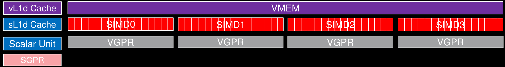
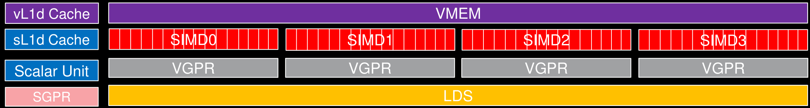
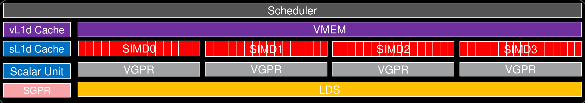
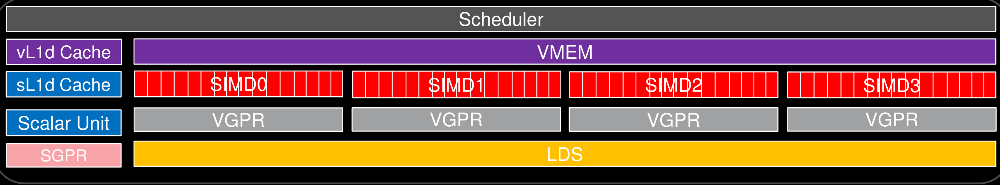

# 03-MemoryHierarchy - Pages 11-20

<!-- Page 11 -->

# The CDNA2 Compute Unit (CU) – Vector Memory Unit

Vector Memory Unit

Vector memory operations from all 4 SIMD units are routed to the Vector Memory Unit (VMEM)

Can handle uncoalesced memory addresses

Connects to a 16 KiB L1 Data Cache (vL1d). Cache lines of 64 bytes (L2 cache line is 128 bytes).

Write-through

vL1d cache not really into the CU but directly connected to it

None

---

<!-- Page 12 -->

# The CDNA2 Compute Unit (CU) - LDS

64 KB Local Data Share (LDS, or shared memory)

32 banks with conflict resolution

Can share data between all work-items in a workgroup

It supports various HW atomic operations for integer, logical, and floating-point data types.

None

---

<!-- Page 13 -->

# The CDNA2 Compute Unit (CU) - Scheduler

- Scheduler

- Buffer for up to 32 wavefronts

- Separate decode/issue for

- VALU, VGPR load/store

- SALU, SGPR load/store

- LDS load/store

- Global mem load/store

- Special instructions (NoOps, barriers, branch instructions)

---

<!-- Page 14 -->

# The CDNA2 Compute Unit (CU) - Scheduler

- Scheduler

- At each clock, waves on 1 SIMD unit are considered for execution (Round Robin scheduling among SIMDs)

- At most 1 instruction per wavefront may be issued

- At most 1 instruction from each category may be issued (VALU, VMEM, SALU/SMEM, LDS, branch)

- Maximum of 5 instructions issued to wavefronts on a single SIMD, per cycle per CU

- VALU instructions take a multiple of four cycles to retire

- e.g. FP32 FMA: cycle 0 – lanes 0-15 | cycle 1 – lanes 16-31 | cycle 2 – lanes 32-47 | cycle 3 – lanes 48-63

- Programmer can still ‘pretend’ CU operates in 64-wide SIMD: 64 FP32 FMA ops / cycle / CU

---

<!-- Page 15 -->

# GPU Occupancy on CDNA2

AMD

---

<!-- Page 16 -->

# What is Occupancy?

Occupancy: the ratio of active wavefronts executing on the GPU to the maximum number of possible wavefronts supported by the hardware.

- Occupancy is controlled by the utilization of resources on a CU

- Can indicate over/under utilization of resources, limiting performance

Different “flavors” of occupancy available:

→ Achieved occupancy is measured on the hardware and is a time-dependent metric (as the number of active wavefronts is not constant)

→ Theoretical occupancy is a calculated metric, derived from the resources requested by the kernel. Compiler can provide this information

→ In addition, occupancy may be reported per-SIMD/EU, per-CU, or per-GPU

To see why occupancy is important, we will consider a batch matrix-vector multiply kernel.

---

<!-- Page 17 -->

# Occupancy: Limiting Factors

Number of wavefronts: max 8 per SIMD, 32 per CU

- Register usage is a big limiting factor to occupancy. Both SGPRs and VGPRTs play a role

- LDS usage is another limiting factor

- Number of wavefronts per workgroup (AKA thread block): max 16 (i.e., max 1024 threads per workgroup).

- Note that all wavefronts of a workgroup are required to be scheduled on the same CU, but not necessarily on the same SIMD of the CU.

---

<!-- Page 18 -->

# Occupancy: Limiting Factors - VGPRs

Vector registers:

- Total of 64x 512 registers available per SIMD (256 VGPRs + 256 AccVGPRs)

- Each wavefront can use up to 256 VGPRs, if more are needed “spilling” to global memory (cacheable)

<table><tr><td>Num VGPRs</td><td>Occupancy per EU</td><td>Occupancy per CU</td></tr><tr><td>≤= 64</td><td>8 waves</td><td>32 waves</td></tr><tr><td>≤= 72</td><td>7 waves</td><td>28 waves</td></tr><tr><td>≤= 80</td><td>6 waves</td><td>24 waves</td></tr><tr><td>≤= 96</td><td>5 waves</td><td>20 waves</td></tr><tr><td>≤= 128</td><td>4 waves</td><td>16 waves</td></tr><tr><td>≤= 168</td><td>3 waves</td><td>12 waves</td></tr><tr><td>≤= 256</td><td>2 waves</td><td>8 waves</td></tr><tr><td>&gt; 256 (+ spilling to AVGPRs/scratch)</td><td>1 waves</td><td>4 waves</td></tr></table>

---

<!-- Page 19 -->

# Occupancy: Limiting Factors - SGPRs

- Scalar registers:

- Total scalar register file size: 12.5 KB (3,200 registers, 800 per SIMD)

- A single wavefront can allocate up to 112 scalar registers in batches of 16

- The last 6 of these are used for special purposes (such as VCC), and these cannot be used as general purpose scalar registers by user code

- The 112 case is special; here, 4 additional registers cannot be used, leaving 102 for GPR purposes

- For each wavefront, 16 additional registers are allocated for a trap handler

- Assuming no register spilling from SGPRs to VGPRTs is performed by the compiler and that the number of VGPRTs is low enough to allow max occupancy, occupancy will be 8 per SIMD up to 100 SGPRs

- When SGPRs usage > 100 occupancy will drop down to 7 wavefronts per SIMD

---

<!-- Page 20 -->

# Occupancy: Register Spilling

- SGPRs

Not observed to be a common source of spilling

- Spilled to vector registers (VGPRs)

- VGPRs

- Spilled to AGPRs, then L2 (L1 is write-through), and finally to HBM

- A wavefront can use directly up to 256 VGPRs. It can spill to up to 256 AVGPRs (assuming no MFMA instructions are used)

- __launch_bounds__(MAX_THREADS_PER_BLOCK, MIN_WARPS_PER_EU)

- A function attribute that must be attached to a global device function

- Provides hints for compiler to manage/reduce register usage per kernel

- MAX_THREADS_PER_BLOCK: guarantees launch size to compiler

- MIN_WARPS_PER_EU: asks compiler to minimize register usage to allow at least x-many warps to be active per SIMD unit/EU

---

