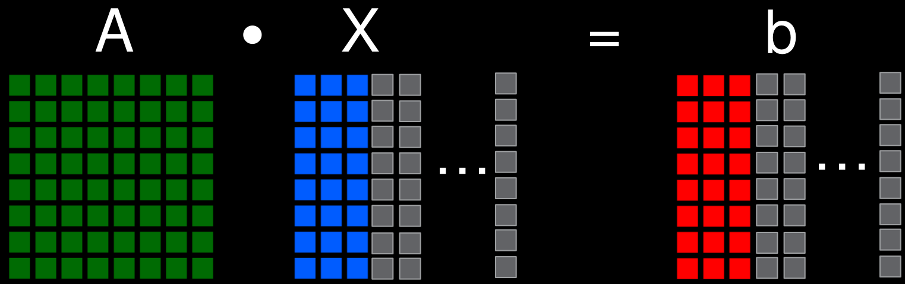
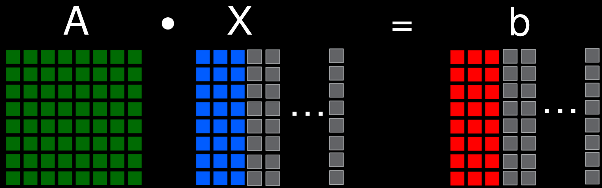
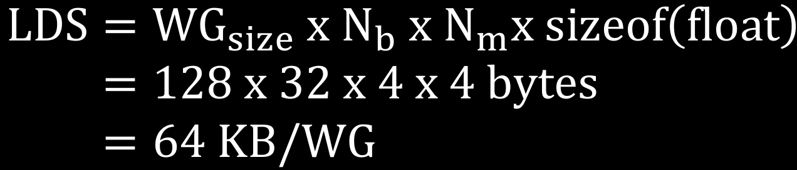
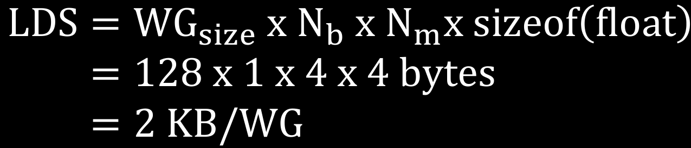
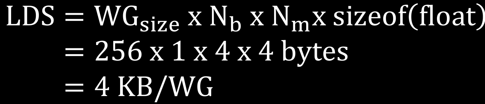

# 03-MemoryHierarchy - Pages 21-30

<!-- Page 21 -->

# Occupancy: Limiting Factors - LDS

- Local Data Share:

- Note that for occupancy calculations, we need to look at the usage per workgroup, not per wavefront

- 64 KB per Compute Unit

---

<!-- Page 22 -->

# Example: batched matrix-vector multiply

As a test-bed for our occupancy calculations, we will use a batched matrix-vector multiplication kernel:

- $\bar{A}$ is a $(\mathrm{N}_\mathrm{m} \times \mathrm{N}_\mathrm{m})$ matrix

- $\vec{x}$ and $\vec{b}$ are $\mathrm{N}_\nu$ vectors each of size $(\mathrm{N}_\mathrm{m} \times 1)$

$$\mathrm {A} \cdot \mathrm {X} = \mathrm {b}$$

---

<!-- Page 23 -->

# Example: batched matrix-vector multiply

Main implementation ideas:

Every work-item multiplies $\bar{A}$ with multiple vectors from $\vec{x}$.

The data of a vector from $\vec{x}$ is reused $\mathrm{N}_m$ times.

Instead of loading a vector from $\vec{x}$ from HBM for every use, we preload a batch of WG-size * $\mathrm{N}_b$ of them in (faster) LDS, and use them repeatedly from there.

$$\mathbf {A} \cdot \mathbf {X} = \mathbf {b}$$

---

<!-- Page 24 -->

# Example occupancy calculation

<table><tr><td>Parameter</td><td>Value</td></tr><tr><td>WG-size</td><td>128</td></tr><tr><td>Nm</td><td>4</td></tr><tr><td>Nb</td><td>32</td></tr><tr><td>Nv</td><td>3.35E+08</td></tr></table>

Kernel configuration V0

Resulting performance ~55 GFLOP/s, very poor! Why?

One reason: using too much LDS per work-group!

mxv.cpp:44:1: remark: SGPRs: 22 [-Rpass-analysis=kernel-resource-usage]

mxv.cpp:44:1: remark: VGPRs: 74 [-Rpass-analysis=kernel-resource-usage]

mxv.cpp:44:1: remark: AGPRs: 0 [-Rpass-analysis=kernel-resource-usage]

mxv.cpp:44:1: remark: ScratchSize [bytes/lane]: 0 [-Rpass-analysis=kernel-resource-usage]

mxv.cpp:44:1: remark: Occupancy [waves/SIMD]: 1 [-Rpass-analysis=kernel-resource-usage]

mxv.cpp:44:1: remark: SGPRs Spill: 0 [-Rpass-analysis=kernel-resource-usage]

mxv.cpp:44:1: remark: VGPRs Spill: 0 [-Rpass-analysis=kernel-resource-usage]

mxv.cpp:44:1: remark: LDS Size [bytes/block]: 65536 [-Rpass-analysis=kernel-resource-usage]

$$\begin{array}{l} \text {L D S} = \text {W G} _ {\text {s i z e}} \times \text {N} _ {\text {b}} \times \text {N} _ {\text {m}} \times \text {s i z e o f} (\text {f l o a t}) \\ = 1 2 8 \times 3 2 \times 4 \times 4 \text {b y t e s} \\ = 6 4 \text {K B} / \text {W G} \\ \end{array}$$

---

<!-- Page 25 -->

# Example occupancy calculation

<table><tr><td>Parameter</td><td>Value</td></tr><tr><td>WG-size</td><td>256</td></tr><tr><td>Nm</td><td>4</td></tr><tr><td>Nb</td><td>16</td></tr><tr><td>Nv</td><td>3.35E+08</td></tr></table>

Kernel configuration V1

Resulting performance ~93 GFLOP/s Why?

mxv.cpp:44:1: remark: SGPRs: 22 [-Rpass-analysis=kernel-resource-usage]

mxv.cpp:44:1: remark: VGPRs: 42 [-Rpass-analysis=kernel-resource-usage]

mxv.cpp:44:1: remark: AGPRs: 0 [-Rpass-analysis=kernel-resource-usage]

mxv.cpp:44:1: remark: ScratchSize [bytes/lane]: 0 [-Rpass-analysis=kernel-resource-usage]

mxv.cpp:44:1: remark: Occupancy [waves/SIMD]: 1 [-Rpass-analysis=kernel-resource-usage]

mxv.cpp:44:1: remark: SGPRs Spill: 0 [-Rpass-analysis=kernel-resource-usage]

mxv.cpp:44:1: remark: VGPRs Spill: 0 [-Rpass-analysis=kernel-resource-usage]

mxv.cpp:44:1: remark: LDS Size [bytes/block]: 65536 [-Rpass-analysis=kernel-resource-usage]

$$\mathrm {L D S} = \mathrm {W G} _ {\text {s i z e}} \times \mathrm {N _ {b}} \times \mathrm {N _ {m}} \times \text {s i z e o f} (\text {f l o a t})$$

$$= 1 2 8 \times 3 2 \times 4 \times 4 \text {b y t e s}$$

$$= 6 4 \mathrm {K B} / \mathrm {W G}$$

---

<!-- Page 26 -->

# Example occupancy calculation

Recall: 64KB of LDS available per CU

$\rightarrow$ Limited to a single WG of 128 work-items per CU in kernel V0

$\rightarrow$ Limited to a single WG of 256 work-items per CU in kernel V1

Recall: 32 Wavefronts possible per CU:

$\rightarrow$ Occupancy $= \frac{2}{32} = 0.0625$ for kernel V0

$\rightarrow$ Occupancy $= \frac{4}{32} = 0.125$ for kernel V1

Solution: lower LDS usage per WG

- In this example, we can either decrease the workgroup size, or decrease the batch size $\mathbf{N_b}$

---

<!-- Page 27 -->

# Example occupancy calculation

<table><tr><td>Parameter</td><td>Value</td></tr><tr><td>WG-size</td><td>128</td></tr><tr><td>Nm</td><td>4</td></tr><tr><td>Nb</td><td>1</td></tr><tr><td>Nv</td><td>3.35E+08</td></tr></table>

Kernel configuration V2

Resulting performance $\sim$1031 GFLOP/s

mxv.cpp:44:1: remark: Occupancy [waves/SIMD]: 8 [-Rpass-analysis=kernel-resource-usage]

mxv.cpp:44:1: remark: LDS Size [bytes/block]: 2048 [-Rpass-analysis=kernel-resource-usage]

$$\begin{array}{l} \text {L D S} = \text {W G} _ {\text {s i z e}} \times \text {N} _ {\text {b}} \times \text {N} _ {\text {m}} \times \text {s i z e o f} (\text {f l o a t}) \\ = 1 2 8 \times 1 \times 4 \times 4 \text {b y t e s} \\ = 2 \text {K B} / \text {W G} \\ \end{array}$$

---

<!-- Page 28 -->

# Example occupancy calculation

<table><tr><td>Parameter</td><td>Value</td></tr><tr><td>WG-size</td><td>256</td></tr><tr><td>Nm</td><td>4</td></tr><tr><td>Nb</td><td>1</td></tr><tr><td>Nv</td><td>3.35E+08</td></tr></table>

Kernel configuration V3

Resulting performance $\sim$1039 GFLOP/s

mxv.cpp:44:1: remark: Occupancy [waves/SIMD]: 8 [-Rpass-analysis=kernel-resource-usage]

mxv.cpp:44:1: remark: LDS Size [bytes/block]: 4096 [-Rpass-analysis=kernel-resource-usage]

$$\begin{array}{l} \text {L D S} = \text {W G} _ {\text {s i z e}} \times \text {N} _ {\text {b}} \times \text {N} _ {\text {m}} \times \text {s i z e o f} (\text {f l o a t}) \\ = 2 5 6 \times 1 \times 4 \times 4 \text {b y t e s} \\ = 4 \text {K B} / \text {W G} \\ \end{array}$$

---

<!-- Page 29 -->

# Wrap Up

An entire workgroup is assigned to a single CU (round-robin across all the various SEs)

An entire wavefront is assigned to a single SIMD unit / execution unit (EU)

It takes 4 cycles to execute an entire wavefront. EUs are 16-wide

256 VGPRs + 256 AccVGPRs (512 total) usable by an EU

256 VGPRs (+256 AccVGPRs for spilling) usable by a wavefront

112 SGPRs usable by a wavefront (only 102 used by kernel)

vL1 cache is 16 KB shared by all EUs (entire CU)

sL1 cache is 16 KB shared by all EUs (entire CU)

LDS is 64 KB per CU

Occupancy limited by:

1. Register pressure – Wavefront level

2. LDS usage – Workgroup level

3. Number of wavefronts per CU (HW limit is 32; 8 wavefronts per EU)

4. Number of wavefronts per workgroup (16 wavefronts max per workgroup)

---

<!-- Page 30 -->

# DISCLAIMERS AND ATTRIBUTIONS

The information contained herein is for informational purposes only and is subject to change without notice. While every precaution has been taken in the preparation of this document, it may contain technical inaccuracies, omissions and typographical errors, and AMD is under no obligation to update or otherwise correct this information. Advanced Micro Devices, Inc. makes no representations or warranties with respect to the accuracy or completeness of the contents of this document, and assumes no liability of any kind, including the implied warranties of noninfringement, merchantability or fitness for particular purposes, with respect to the operation or use of AMD hardware, software or other products described herein. No license, including implied or arising by estoppel, to any intellectual property rights is granted by this document. Terms and limitations applicable to the purchase or use of AMD's products are as set forth in a signed agreement between the parties or in AMD's Standard Terms and Conditions of Sale. GD-18

THIS INFORMATION IS PROVIDED 'AS IS.' AMD MAKES NO REPRESENTATIONS OR WARRANTY WITH RESPECT TO THE CONTENTS HEREOF AND ASSUMES NO RESPONSIBILITY FOR ANY INACCURACIES, ERRORS, OR OMISSIONS THAT MAY APPEAR IN THIS INFORMATION. AMD SPECIFICALLY DISCLAIMS ANY IMPLIED WARRANTY OF NON-INFRINGEMENT, MERCHANTABILITY, OR FITNESS FOR ANY PARTICULAR PURPOSE. IN NO EVENT WILL AMD BE LIABLE TO ANY PERSON FOR ANY RELIANCE, DIRECT, INDIRECT, SPECIAL, OR OTHER CONSEQUENTIAL DAMAGES ARISING FROM THE USE OF ANY INFORMATION CONTAINED HEREIN, EVEN IF AMD IS EXPRESSLY ADVISED OF THE POSSIBILITY OF SUCH DAMAGES.

© 2023 Advanced Micro Devices, Inc. All rights reserved.

AMD, the AMD Arrow logo, Radeon, Instinct, EPYC, Infinity Fabric, ROCm, and combinations thereof are trademarks of Advanced Micro Devices, Inc. Other product names used in this publication are for identification purposes only and may be trademarks of their respective companies.

---

