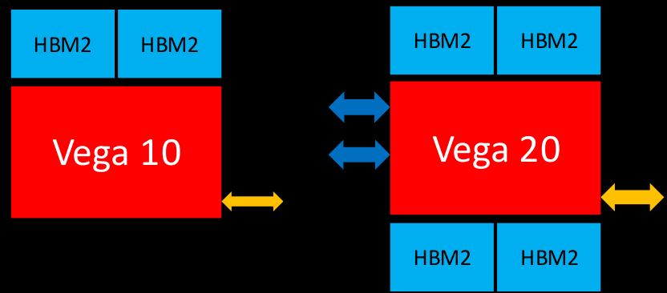
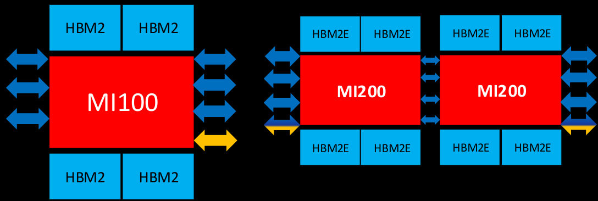

# Table of Contents

- [AMD GCN/CDNA Architecture Training Memory, IO, and CU Architecture on gfx9 GPUs](#amd-gcncdna-architecture-training-memory-io-and-cu-architecture-on-gfx9-gpus)
- [AGENDA](#agenda)
- [AMD GCN Assembly Instruction Classes](#amd-gcn-assembly-instruction-classes)
- [Reminder of GPU Kernel Layout](#reminder-of-gpu-kernel-layout)
- [Wavefronts on AMD GCN GPUs](#wavefronts-on-amd-gcn-gpus)
- [An Example SIMT Kernel](#an-example-simt-kernel)
- [GCN Compute Unit Internals](#gcn-compute-unit-internals)
- [Wavefronts in a Sea of Compute Units](#wavefronts-in-a-sea-of-compute-units)
- [Inside a Compute Unit – Wavefront Slots](#inside-a-compute-unit-wavefront-slots)
- [Compute Unit Internals](#compute-unit-internals)
- [AMD GCN Instruction Classes](#amd-gcn-instruction-classes)
- [Inside a Compute Unit – Vector ALUs](#inside-a-compute-unit-vector-alus)
- [Inside a Compute Unit – Vector ALUs](#inside-a-compute-unit-vector-alus)
- [Inside a Compute Unit – Vector Register Files](#inside-a-compute-unit-vector-register-files)
- [Compute Unit Internals](#compute-unit-internals)
- [AMD GCN Instruction Classes](#amd-gcn-instruction-classes)
- [Inside a Compute Unit – Vector Memory](#inside-a-compute-unit-vector-memory)
- [Vector Memory Unit](#vector-memory-unit)
- [Compute Unit Internals](#compute-unit-internals)
- [On-chip Memory System](#on-chip-memory-system)
- [On-chip Memory System](#on-chip-memory-system)
- [Per-CU Vector L1 Data Cache (TCP)](#per-cu-vector-l1-data-cache-tcp)
- [Compute Unit](#compute-unit)
- [AMD GCN Instruction Classes](#amd-gcn-instruction-classes)
- [Inside a Compute Unit – Local Data Share](#inside-a-compute-unit-local-data-share)
- [Compute Unit Internals](#compute-unit-internals)
- [AMD GCN Instruction Classes](#amd-gcn-instruction-classes)
- [Inside a Compute Unit – Scalar ALU](#inside-a-compute-unit-scalar-alu)
- [Scalar ALU](#scalar-alu)
- [Scalar Register File](#scalar-register-file)
- [Compute Unit Internals](#compute-unit-internals)
- [AMD GCN Instruction Classes](#amd-gcn-instruction-classes)
- [Inside a Compute Unit – Scalar Memory](#inside-a-compute-unit-scalar-memory)
- [Scalar Memory Unit](#scalar-memory-unit)
- [Compute Unit Internals](#compute-unit-internals)
- [On-chip Memory System](#on-chip-memory-system)
- [One Scalar L1 Data Cache shared by 4 CUs](#one-scalar-l1-data-cache-shared-by-4-cus)
- [Scalar L1 Data Cache](#scalar-l1-data-cache)
- [Scalar L1 DTLB](#scalar-l1-dtlb)
- [AMD GCN Instruction Classes](#amd-gcn-instruction-classes)
- [Inside a Compute Unit – Branch Unit](#inside-a-compute-unit-branch-unit)
- [Branch Unit](#branch-unit)
- [Compute Unit Internals](#compute-unit-internals)
- [AMD GCN Instruction Classes](#amd-gcn-instruction-classes)
- [Compute Unit Internals](#compute-unit-internals)
- [One L1 Instruction Cache shared by 4 CUs](#one-l1-instruction-cache-shared-by-4-cus)
- [L1 Instruction Cache](#l1-instruction-cache)
- [L1 ITLB](#l1-itlb)
- [Inside a Compute Unit – Fetch and Decode Unit](#inside-a-compute-unit-fetch-and-decode-unit)
- [Inside a Compute Unit – Fetch and Decode Unit](#inside-a-compute-unit-fetch-and-decode-unit)
- [Compute Unit Internals](#compute-unit-internals)
- [On-chip Memory System](#on-chip-memory-system)
- [On-chip Memory System](#on-chip-memory-system)
- [Shared L2 Cache is a Coherence Point for Graphics Clients](#shared-l2-cache-is-a-coherence-point-for-graphics-clients)
- [L2 Cache (TCC)](#l2-cache-tcc)
- [Shared L2 TLB for Graphics Core Clients](#shared-l2-tlb-for-graphics-core-clients)
- [L2 TLB](#l2-tlb)
- [4 KiB Pages](#4-kib-pages)
- [2 MiB Pages](#2-mib-pages)
- [Page Table Walker](#page-table-walker)
- [L2 Cache](#l2-cache)
- [GPU Memory System – Getting Off Chip](#gpu-memory-system-getting-off-chip)
- [On-chip Memory System](#on-chip-memory-system)
- [Efficiency Arbiters Order Accesses to Memory and Off-Chip Buses](#efficiency-arbiters-order-accesses-to-memory-and-off-chip-buses)
- [Efficiency Arbiter](#efficiency-arbiter)
- [On-chip Memory System](#on-chip-memory-system)
- [On-chip Memory System](#on-chip-memory-system)
- [AMD](#amd)
- [Comparing AMD GPUs](#comparing-amd-gpus)
- [AMD "Graphics Core Next" GPU Generations](#amd-graphics-core-next-gpu-generations)
- [GCN Generations – Compiler and Driver View](#gcn-generations-compiler-and-driver-view)
- [AMD GPU Speeds Comparison](#amd-gpu-speeds-comparison)
- [AMD GPU Feeds Comparison](#amd-gpu-feeds-comparison)
- [Hardware Terminology – Translation key if you are familiar with Nvidia GPUs](#hardware-terminology-translation-key-if-you-are-familiar-with-nvidia-gpus)
- [DISCLAIMER](#disclaimer)
- [DISCLAIMER](#disclaimer)

---

<!-- Page 1 -->


# AMD GCN/CDNA Architecture Training Memory, IO, and CU Architecture on gfx9 GPUs


Joseph Greathouse


Machine Learning Software Engineering (MLSE)


RTG, AMD


Apr. 14, 2020


---

<!-- Page 2 -->


# AGENDA


GCN Assembly AMD GCN Assembly Instruction Classes


SIMT Program Example


Branching in a SIMT Program


Hardware Internals Compute Units


Memory System


Input/Output Efficiency Arbiters


SDMAs


---

<!-- Page 3 -->


# AMD GCN Assembly Instruction Classes


---

<!-- Page 4 -->


# Reminder of GPU Kernel Layout


<table><tr><td colspan="5">GPU Kernel</td></tr><tr><td colspan="5">Workgroup 0</td></tr><tr><td>Wavefront 0</td><td>64 work items (threads)</td><td>Wavefront 1</td><td>...</td><td>Wavefront 15</td></tr><tr><td>Workgroup 1</td><td colspan="4">Wavefront<br/>Collection of resources that execute in lockstep, run the same instructions, and follow the same control-flow path. Individual lanes can be masked off. Can think of this as a vector thread, or a thread running SIMD instructions.</td></tr><tr><td>Workgroup 2</td><td colspan="4"></td></tr><tr><td>Workgroup 3</td><td colspan="4"></td></tr><tr><td>Workgroup 4</td><td colspan="4"></td></tr><tr><td>...</td><td colspan="4"></td></tr><tr><td>Workgroup n</td><td colspan="4"></td></tr></table>


---

<!-- Page 5 -->


# Wavefronts on AMD GCN GPUs


Wavefront 64 work items (threads)


AMD GCN Compute Units execute wavefronts, not work items.


Each wavefront has instructions in various classes:


- Vector ALU (VALU): 64-wide ALU instruction.


- FP16, FP32, FP64, integer, bitwise operators can all be VALU.


- Each lane can operate on a different value. Individual lanes can be masked off.


- Vector Memory (VMEM): 64-wide memory instruction.


- Each lane can touch a different location. Individual lanes can be masked off.


- Local Data Share (LDS): 64-wide memory operations to per-CU scratchpad.


- Each lane can touch a different location. Individual lanes can be masked off.


- Scalar ALU (SALU): ALU operation if every thread is working on identical data. Has its own registers.


- Scalar Memory (SMEM): Identical memory operation in all lanes. Uses scalar register file.


- Branch: Used if the entire wavefront wants to branch.


- Per-thread branching will run both sides of the branch with different lane masks.


- Internal: Wavefront bookkeeping. NOPs, workgroup barriers, wait-for-memory, etc.


---

<!-- Page 6 -->


# An Example SIMT Kernel


---

<!-- Page 7 -->


SIMT Shifted Copy Kernel in HIP


Every thread copies a float from array in[] to array out[]


```code
__global__ void shifted_copy (float *in, float *out) {
    size_t gid = blockDim.x * blockIdx.x + threadIdx.x
    out[gid] = in[gid+4];
}
```


SIMT programming model implies parallelism between threads.


Every HIP Thread reads one value and writes one value, based on its global thread ID


---

<!-- Page 8 -->


SIMT Copy Kernel in AMD GCN Assembly


```code
__global__ void shifted_copy (float *in, float *out) {
    size_t gid = blockDim.x * blockIdx.x + threadIdx.x
    out[gid] = in[gid + 4];
}
```


- Skipping some function prologue. Starting state:


- Scalar registers SGPR5 and SGPR4 concatenate together to hold pointer to kernel argument structure.
- Vector registers VGPR3 and VGPR2 concatenated together hold the per-thread global ID variable “gid”


```code
s_load_dwordx4 s[0:3], s[4:5], 0 ; Load in[] to SGPR1:SGPR0 and out[] into SGPR3:SGPR2.
v_lshlrev_b64 v[2:3], 2, v[2:3] ; GID*=4 for float array offset.
s_waitcnt lgkmcnt(0) ; Wavefront does not proceed until previous SMEM access completes.
s_add_u32 s0, 16, s0 ; Add 16 to SGPR0 to shift in[] four floats over. May cause carry-out.
s_addc_u32 s1, 0, s1 ; Add any carry from the previous instruction into SGPR1.
v_add_co_u32 v0, s0, v2 ; Add low GID*4 to low in[]. Store in VGPR0.
v_addc_co_u32 v1, s1, v3 ; Add high GID*4 to high in[] with carry-in. Store in VGPR1.
global_load_dword v4, v[0:1] ; Read 64 floats from 64 locations from VGPR1:VGPR0 into VGPR4.
v_add_co_u32 v0, s2, v2 ; Add low GID*4 to low out[]. Store in VGPR0.
v_addc_co_u32 v1, s3, v3 ; Add high GID*4 to high out[] with carry-in. Store in VGPR1.
s_waitcnt vmcnt(0) ; Wavefront does not proceed until all previous VMEM accesses complete.
global_store_dword v[0:1], v4 ; Store 64 floats from VGR4 into 64 locations from VGPR1:VGPR0.
s_endpgm ; This wavefront is done. Exit when the store completes.
```


---

<!-- Page 9 -->


SIMT Copy Kernel in AMD GCN Assembly


```code
__global__ void shifted_copy (float *in, float *out) {
    size_t gid = blockDim.x * blockIdx.x + threadIdx.x
    out[gid] = in[gid + 4];
}
```


- Skipping some function prologue. Starting state:


- Scalar registers SGPR5 and SGPR4 concatenate together to hold pointer to kernel argument structure.
- Vector registers VGPR3 and VGPR2 concatenated together hold the per-thread GID variable


---

<!-- Page 10 -->


[AMD Official Use Only - Internal Distribution Only]


---

<!-- Page 11 -->


An Example SIMT Kernel with Branching


---

<!-- Page 12 -->


SIMT Shifted Copy Kernel in HIP


Conditionally copy some values from array in[] to array out[]


```code
__global__ void conditional_copy (double *in, double *out) {
    size_t gid = blockDim.x * blockIdx.x + threadIdx.x
    if (in[gid] > 0)
        out[gid] = in[gid];
}
```


Each HIP Thread can read a different value, some will go into the conditional statement


---

<!-- Page 13 -->


[AMD Official Use Only - Internal Distribution Only]


SIMT Copy Kernel in AMD GCN Assembly


```code
__global__ void conditional_copy (double *in, double *out) {
    size_t gid = blockDim.x * blockIdx.x + threadIdx.x
    if (in[gid] > 0.)
        out[gid] = in[gid];
}
```


- Skipping some function prologue. Starting state:


- Scalar registers SGPR5 and SGPR4 concatenate together to hold pointer to kernel argument structure.


- Vector registers VGPR3 and VGPR2 concatenated together hold the per-thread global ID variable “gid”


s_load_dwordx4 s[0:3], s[4:5], 0 ; Load in[] to SGPR1:SGPR0 and out[] into SGPR3:SGPR2.


v_lshlrev_b64 v[2:3], 3, v[2:3] ; GID*=8 for double array offset.


s_waitcnt lgmcnt(0) ; Wavefront does not proceed until previous SMEM access completes.


v_add_co_u32 v0, s0, v2 ; Add low GID*8 to low in[]. Store in VGPR0.


v_addc_co_u32 v1, s1, v3 ; Add high GID*8 to high in[] with carry-in. Store in VGPR1.


global_load_dwordx2 v[4:5], v[0:1] ; Read 64 doubles from 64 locations from VGPR1:VGPR0 into VGPR5:VGPR4.


s_waitcnt vmcnt(0) ; Wavefront does not proceed until all previous VMEM accesses complete.


v_cmp_lt_f64 vcc, 0, v[4:5] ; Set this thread’s bit in VCC if 0 < VGPR[4:5] (0. < in[gid]).


s_and_saveexec_b64 s[4:5], vcc ; Save old EXEC into S[4:5]. AND VCC into the EXEC mask.


s_cbranch_execz BB0_2 ; If EXEC mask is all 0, branch to BB0_2 label.


v_add_co_u32 v0, s2, v2 ; Add low GID*8 to low out[] if this thread’s EXEC bit == 1.


v_addc_co_u32 v1, s3, v3 ; Add high GID*8 to high out[] with carry-in if EXEC bit == 1.


global_store_dword v[0:1], v[4:5] ; Store to output address if this thread’s EXEC bit == 1.


BB0_2:


s_or_b64 exec, exec, s[4:5] ; OR saved-off EXEC mask back into the current EXEC mask.


s_endpgm ; This wavefront is done. Exit when the store completes.


---

<!-- Page 14 -->


SIMT Branching Mechanisms


```code
v_cmp_lt_f64 vcc, 0, v[4:5] ; Set this thread’s bit in VCC if 0 < VGPR[4:5] (0. < in[gid]).
s_and_saveexec_b64 s[4:5], vcc ; Save old EXEC into S[4:5]. AND VCC into the EXEC mask.
s_cbranch_execz BB0_2 ; If EXEC mask is all 0, branch to BB0_2 label.
v_add_co_u32 v0, s2, v2 ; Add low GID*8 to low out[] if this thread’s EXEC bit == 1.
v_addc_co_u32 v1, s3, v3 ; Add high GID*8 to high out[] with carry-in if EXEC bit == 1.
global_store_dwordx2 v[0:1], v[4:5] ; Store to output address if this thread’s EXEC bit == 1.
BB0_2:
s_or_b64 exec, exec, s[4:5] ; OR saved-off EXEC mask back into the current EXEC mask.
```

<table><tr><td colspan="4">EXEC</td><td colspan="4">VCC</td><td>EXECZ</td></tr><tr><td>1</td><td>0</td><td>1</td><td>0</td><td>AND</td><td>1</td><td>0</td><td>1</td><td>0</td></tr><tr><td colspan="4">2 EXEC bits == 1: Two stores</td><td></td><td></td><td></td><td></td><td></td></tr><tr><td colspan="4">VGPR[4:5]</td><td colspan="4">SGPR[4:5]</td><td></td></tr><tr><td>3.14</td><td>-1</td><td>1.2</td><td>0</td><td colspan="4">0xf</td><td></td></tr></table>


---

<!-- Page 15 -->


SIMT Branching Mechanisms


```code
v_cmp_lt_f64 vcc, 0, v[4:5] ; Set this thread’s bit in VCC if 0 < VGPR[4:5] (0. < in[gid]).
s_and_saveexec_b64 s[4:5], vcc ; Save old EXEC into S[4:5]. AND VCC into the EXEC mask.
s_cbranch_execz BB0_2     ; If EXEC mask is all 0, branch to BB0_2 label.
v_add_co_u32 v0, s2, v2   ; Add low GID*8 to low out[] if this thread’s EXEC bit == 1.
v_addc_co_u32 v1, s3, v3  ; Add high GID*8 to high out[] with carry-in if EXEC bit == 1.
global_store_dwordx2 v[0:1], v[4:5] ; Store to output address if this thread’s EXEC bit == 1.
BB0_2:
s_or_b64 exec, exec, s[4:5] ; OR saved-off EXEC mask back into the current EXEC mask.
```


---

<!-- Page 16 -->


SIMT Branching Mechanisms


```code
v_cmp_lt_f64 vcc, 0, v[4:5] ← Vector ALU
s_and_saveexec_b64 s[4:5], vcc ← Scalar ALU
s_cbranch_execz BB0_2 ← Branch
v_add_co_u32 v0, s2, v2
v_addc_co_u32 v1, s3, v3
global_store_dwordx2 v[0:1], v[4:5]
BB0_2:
s_or_b64 exec, exec, s[4:5]
```


---

<!-- Page 17 -->


# GCN Compute Unit Internals


---

<!-- Page 18 -->


# Wavefronts in a Sea of Compute Units


HSA Queue


HSA Queue


Command Processor


<table><tr><td></td><td>CU</td><td></td><td>CU</td><td></td></tr><tr><td></td><td>CU</td><td></td><td>CU</td><td></td></tr><tr><td></td><td>CU</td><td></td><td>CU</td><td></td></tr><tr><td></td><td>CU</td><td></td><td>CU</td><td></td></tr><tr><td></td><td>CU</td><td></td><td>CU</td><td></td></tr><tr><td></td><td>CU</td><td></td><td>CU</td><td></td></tr><tr><td></td><td>CU</td><td></td><td>CU</td><td></td></tr><tr><td></td><td>CU</td><td></td><td>CU</td><td></td></tr></table>

SPI (SE0)


<table><tr><td></td><td>CU</td><td></td><td>CU</td><td></td></tr><tr><td></td><td>CU</td><td></td><td>CU</td><td></td></tr><tr><td></td><td>CU</td><td></td><td>CU</td><td></td></tr><tr><td></td><td>CU</td><td></td><td>CU</td><td></td></tr><tr><td></td><td>CU</td><td></td><td>CU</td><td></td></tr><tr><td></td><td>CU</td><td></td><td>CU</td><td></td></tr><tr><td></td><td>CU</td><td></td><td>CU</td><td></td></tr><tr><td></td><td>CU</td><td></td><td>CU</td><td></td></tr></table>

SPI (SE1)


<table><tr><td></td><td>CU</td><td></td><td>CU</td><td></td></tr><tr><td></td><td>CU</td><td></td><td>CU</td><td></td></tr><tr><td></td><td>CU</td><td></td><td>CU</td><td></td></tr><tr><td></td><td>CU</td><td></td><td>CU</td><td></td></tr><tr><td></td><td>CU</td><td></td><td>CU</td><td></td></tr><tr><td></td><td>CU</td><td></td><td>CU</td><td></td></tr><tr><td></td><td>CU</td><td></td><td>CU</td><td></td></tr><tr><td></td><td>CU</td><td></td><td>CU</td><td></td></tr></table>

SPI (SE3)


<table><tr><td></td><td>CU</td><td></td><td>CU</td><td></td></tr><tr><td></td><td>CU</td><td></td><td>CU</td><td></td></tr><tr><td></td><td>CU</td><td></td><td>CU</td><td></td></tr><tr><td></td><td>CU</td><td></td><td>CU</td><td></td></tr><tr><td></td><td>CU</td><td></td><td>CU</td><td></td></tr><tr><td></td><td>CU</td><td></td><td>CU</td><td></td></tr><tr><td></td><td>CU</td><td></td><td>CU</td><td></td></tr><tr><td></td><td>CU</td><td></td><td>CU</td><td></td></tr></table>

SPI (SE2)


---

<!-- Page 19 -->


# Inside a Compute Unit – Wavefront Slots


Compute Unit

<table><tr><td>VMID 1, K0, WG0, WF0</td><td>VMID 1, K0, WG0, WF1</td><td>VMID 1, K0, WG0, WF2</td><td>VMID 1, K0, WG0, WF3</td></tr><tr><td>VMID 2, K0, WG0, WF0</td><td>VMID 2, K0, WG0, WF1</td><td>VMID 2, K0, WG0, WF2</td><td>VMID 2, K0, WG0, WF3</td></tr><tr><td>VMID 3, K0, WG0, WF0</td><td>VMID 3, K0, WG0, WF1</td><td>VMID 3, K0, WG0, WF2</td><td>VMID 3, K0, WG0, WF3</td></tr><tr><td>VMID 4, K0, WG0, WF0</td><td>VMID 4, K0, WG0, WF1</td><td>VMID 5, K0, WG0, WF0</td><td>VMID 5, K0, WG0, WF1</td></tr><tr><td>VMID 5, K0, WG0, WF2</td><td>VMID 5, K0, WG0, WF3</td><td>VMID 5, K0, WG0, WF4</td><td>VMID 5, K0, WG0, WF5</td></tr><tr><td>VMID 5, K0, WG0, WF6</td><td>VMID 5, K1, WG0, WF7</td><td>VMID 5, K1, WG0, WF8</td><td>VMID 5, K1, WG0, WF9</td></tr><tr><td>VMID 1, K1, WG0, WF0</td><td>VMID 1, K1, WG0, WF1</td><td>VMID 1, K1, WG0, WF2</td><td>VMID 1, K1, WG0, WF3</td></tr><tr><td>VMID 1, K1, WG1, WF0</td><td>VMID 1, K1, WG1, WF1</td><td>VMID 1, K1, WG1, WF2</td><td>VMID 1, K1, WG1, WF3</td></tr></table>

Four (4) sets of wavefront slots per CU


Up to eight (8) wavefronts in each set: VMID, PC, workgroup, pointers into register file, etc.


Up to 16 VMIDs in a CU simultaneously.


Any wavefront can be from a different process, kernel, workgroup.


Filled by SPI when launching the wavefront, emptied by shader running s_endpgm instruction.


None


---

<!-- Page 20 -->


# Compute Unit Internals


Compute Unit

<table><tr><td>Wave Slots</td><td>Wave Slots</td><td>Wave Slots</td><td>Wave Slots</td></tr></table>


---

<!-- Page 21 -->


# AMD GCN Instruction Classes


Vector ALU (VALU): 64-wide ALU instruction.


Vector Memory (VMEM): 64-wide memory instruction.


Local Data Share (LDS): 64-wide memory operations to CU scratchpad.


Scalar ALU (SALU): ALU operation if every thread is working on identical data.


Scalar Memory (SMEM): Identical memory operation in all lanes.


Branch: Used if the entire wavefront wants to branch.


Internal: Wavefront bookkeeping. NOPs, workgroup barriers, wait-for-memory, etc.


---

<!-- Page 22 -->


# Inside a Compute Unit – Vector ALUs


<table><tr><td colspan="16">GEMM Calculation Unit</td></tr><tr><td>ALU Lane</td><td>ALU Lane</td><td>ALU Lane</td><td>ALU Lane</td><td>ALU Lane</td><td>ALU Lane</td><td>ALU Lane</td><td>ALU Lane</td><td>ALU Lane</td><td>ALU Lane</td><td>ALU Lane</td><td>ALU Lane</td><td>ALU Lane</td><td>ALU Lane</td><td>ALU Lane</td><td>ALU Lane</td></tr></table>

16-wide Vector Arithmetic Logic Unit: SIMD-16


- 4 per CU. Each will only run VALU instructions from its associated set of wave slots.


- Performs vectorized logical, integer, FP16, FP32, and FP64 operations.


- Supports FMA for FP64, FP32, and FP16 (FP16 as of Vega 20).


- Warning: 0.5 ULP accurate division generates reciprocal, multiply, and fixup instructions.


- Configurable denorm and rouding modes; FP32 and FP16/FP64 configured separately.


- $\geq$ MI100: Each VALU unit also contains hardware for BF16, FP16, and FP32 GEMM.


- MI200 adds DGEMM acceleration.


---

<!-- Page 23 -->


# Inside a Compute Unit – Vector ALUs


<table><tr><td colspan="14">GEMM Calculation Unit</td></tr><tr><td>ALU Lane</td><td>ALU Lane</td><td>ALU Lane</td><td>ALU Lane</td><td>ALU Lane</td><td>ALU Lane</td><td>ALU Lane</td><td>ALU Lane</td><td>ALU Lane</td><td>ALU Lane</td><td>ALU Lane</td><td>ALU Lane</td><td>ALU Lane</td><td>ALU Lane</td></tr></table>

<table><tr><td></td><td>“Vega 10”</td><td>“Vega 20”</td><td>“MI100”</td><td>“MI200”</td></tr><tr><td>Trad. FP32 FLOP/cycle</td><td>32</td><td>32</td><td>32</td><td>32</td></tr><tr><td>Trad. FP64 FLOP/cycle</td><td>2</td><td>16</td><td>16</td><td>32</td></tr><tr><td>Packed FP16 FLOP/cycle</td><td>64</td><td>64</td><td>64</td><td>64</td></tr><tr><td>FP16/int16 dot Op/cycle</td><td>-</td><td>64</td><td>64</td><td>64</td></tr><tr><td>int8 dot Op/cycle</td><td>-</td><td>128</td><td>128</td><td>128</td></tr><tr><td>int4 dot Op/cycle</td><td>-</td><td>256</td><td>256</td><td>256</td></tr><tr><td>FP32 GEMM FLOP/cycle</td><td>-</td><td>-</td><td>64</td><td>64</td></tr><tr><td>FP16/int8 GEMM Op/cycle</td><td>-</td><td>-</td><td>256</td><td>256</td></tr><tr><td>BF16 GEMM FLOP/cycle</td><td>-</td><td>-</td><td>128</td><td>256</td></tr><tr><td>FP64 GEMM FLOP/cycle</td><td>-</td><td>-</td><td>-</td><td>64</td></tr><tr><td>Packed FP32 FLOP/cycle</td><td>-</td><td>-</td><td>-</td><td>64</td></tr></table>


---

<!-- Page 24 -->


# Inside a Compute Unit – Vector Register Files


<table><tr><td>Vector Reg</td><td>Vector Reg</td><td>Vector Reg</td><td>Vector Reg</td><td>Vector Reg</td><td>Vector Reg</td><td>Vector Reg</td><td>Vector Reg</td><td>Vector Reg</td><td>Vector Reg</td><td>Vector Reg</td><td>Vector Reg</td><td>Vector Reg</td><td>Vector Reg</td></tr></table>

Each VGPR is 64 registers wide. Each wavefront's VALU lane (thread) accesses one of them.


- Data Parallel Primitive (DPP) instructions allow sourcing from another lane's register.


- All registers are 4 bytes (DWORD) wide. 64-bit values are stored in two contiguous VGPRs.


- Vega 20: 256 VGPRs per VALU.


- MI100: 256 VGPRs for traditional VALU. 256 accVGPRs for GEMM acceleration.


- MI200: Shared 512 VGPRs per VALU.


- Every wavefront can use up to 256 VGPRs (and 256 accVGPRs)


<table><tr><td>VGPRs</td><td>32</td><td>36</td><td>40</td><td>48</td><td>64</td><td>84</td><td>≤ 128</td><td>&gt; 128</td></tr><tr><td>Waves/SIMD-16</td><td>8</td><td>7</td><td>6</td><td>5</td><td>4</td><td>3</td><td>2</td><td>1</td></tr></table>

- Double the above register counts for MI200 if you are not using accVGPRs.


---

<!-- Page 25 -->


# Compute Unit Internals


Compute Unit

<table><tr><td>Wave Slots</td><td>Wave Slots</td><td>Wave Slots</td><td>Wave Slots</td></tr></table>

<table><tr><td>Vector ALU</td><td>Vector ALU</td><td>Vector ALU</td><td>Vector ALU</td></tr><tr><td></td><td></td><td></td><td></td></tr><tr><td></td><td></td><td></td><td></td></tr><tr><td></td><td></td><td></td><td></td></tr><tr><td>Vector Registers</td><td>Vector Registers</td><td>Vector Registers</td><td>Vector Registers</td></tr></table>


---

<!-- Page 26 -->


# AMD GCN Instruction Classes


Vector ALU (VALU): 64-wide ALU instruction.


Vector Memory (VMEM): 64-wide memory instruction.


Local Data Share (LDS): 64-wide memory operations to CU scratchpad.


Scalar ALU (SALU): ALU operation if every thread is working on identical data.


Scalar Memory (SMEM): Identical memory operation in all lanes.


Branch: Used if the entire wavefront wants to branch.


Internal: Wavefront bookkeeping. NOPs, workgroup barriers, wait-for-memory, etc.


---

<!-- Page 27 -->


# Inside a Compute Unit – Vector Memory


# Vector Memory Unit


Vector memory operations from all 4 wave slot groups are routed to this unit.


- Transfers data between global memory and VGPRs


A wavefront issuing a VMEM instruction requires the VMEM unit for 4 cycles to issue addresses.


Can handle uncoalesced addresses (e.g., each lane to a different address).


- Includes request coalescing logic to increase performance / minimize requests out of the CU.


Can write out 64B per cycle, or read in 64B per cycle.


- Connects to a 16 KiB vector L1 data cache, and out to further memory system.


- Includes logic for Buffer memory accesses, which can perform complex offsetting calculations automatically.


---

<!-- Page 28 -->


# Compute Unit Internals


Compute Unit

<table><tr><td>Wave Slots</td><td>Wave Slots</td><td>Wave Slots</td><td>Wave Slots</td></tr></table>

Vector Memory Unit


<table><tr><td>Vector ALU</td><td>Vector ALU</td><td>Vector ALU</td><td>Vector ALU</td></tr><tr><td></td><td></td><td></td><td></td></tr><tr><td></td><td></td><td></td><td></td></tr><tr><td>Vector Registers</td><td>Vector Registers</td><td>Vector Registers</td><td>Vector Registers</td></tr></table>


---

<!-- Page 29 -->


# On-chip Memory System


<table><tr><td rowspan="8">SE</td><td>CU</td><td rowspan="8"></td></tr><tr><td>CU</td></tr><tr><td>CU</td></tr><tr><td>CU</td></tr><tr><td>CU</td></tr><tr><td>CU</td></tr><tr><td>CU</td></tr><tr><td>CU</td></tr><tr><td rowspan="8">SE</td><td>CU</td><td rowspan="8"></td></tr><tr><td>CU</td></tr><tr><td>CU</td></tr><tr><td>CU</td></tr><tr><td>CU</td></tr><tr><td>CU</td></tr><tr><td>CU</td></tr><tr><td>CU</td></tr><tr><td colspan="3">GPU</td></tr><tr><td rowspan="8"></td><td>CU</td><td rowspan="8">SE</td></tr><tr><td>CU</td></tr><tr><td>CU</td></tr><tr><td>CU</td></tr><tr><td>CU</td></tr><tr><td>CU</td></tr><tr><td>CU</td></tr><tr><td>CU</td></tr><tr><td colspan="3">Memory Controllers</td></tr><tr><td colspan="3">HBM/GDDR Memory</td></tr></table>


---

<!-- Page 30 -->


# On-chip Memory System


<table><tr><td rowspan="8">SE</td><td>CU</td><td>Vector L1 DCache</td></tr><tr><td>CU</td><td>Vector L1 DCache</td></tr><tr><td>CU</td><td>Vector L1 DCache</td></tr><tr><td>CU</td><td>Vector L1 DCache</td></tr><tr><td>CU</td><td>Vector L1 DCache</td></tr><tr><td>CU</td><td>Vector L1 DCache</td></tr><tr><td>CU</td><td>Vector L1 DCache</td></tr><tr><td>CU</td><td>Vector L1 DCache</td></tr></table>

<table><tr><td>Vector L1 DCache</td><td>CU</td><td rowspan="8">SE</td></tr><tr><td>Vector L1 DCache</td><td>CU</td></tr><tr><td>Vector L1 DCache</td><td>CU</td></tr><tr><td>Vector L1 DCache</td><td>CU</td></tr><tr><td>Vector L1 DCache</td><td>CU</td></tr><tr><td>Vector L1 DCache</td><td>CU</td></tr><tr><td>Vector L1 DCache</td><td>CU</td></tr><tr><td>Vector L1 DCache</td><td>CU</td></tr></table>

<table><tr><td rowspan="8">SE</td><td>CU</td><td>Vector L1 DCache</td></tr><tr><td>CU</td><td>Vector L1 DCache</td></tr><tr><td>CU</td><td>Vector L1 DCache</td></tr><tr><td>CU</td><td>Vector L1 DCache</td></tr><tr><td>CU</td><td>Vector L1 DCache</td></tr><tr><td>CU</td><td>Vector L1 DCache</td></tr><tr><td>CU</td><td>Vector L1 DCache</td></tr><tr><td>CU</td><td>Vector L1 DCache</td></tr></table>

<table><tr><td>Vector L1 DCache</td><td>CU</td><td rowspan="8">SE</td></tr><tr><td>Vector L1 DCache</td><td>CU</td></tr><tr><td>Vector L1 DCache</td><td>CU</td></tr><tr><td>Vector L1 DCache</td><td>CU</td></tr><tr><td>Vector L1 DCache</td><td>CU</td></tr><tr><td>Vector L1 DCache</td><td>CU</td></tr><tr><td>Vector L1 DCache</td><td>CU</td></tr><tr><td>Vector L1 DCache</td><td>CU</td></tr></table>

Memory Controllers


HBM/GDDR Memory


---

<!-- Page 31 -->


# Per-CU Vector L1 Data Cache (TCP)


# Compute Unit


64-wide Vector Memory Unit


Read 64B/cycle Write 64B/cycle (or send read addr)


<p data-bbox="399,162,661,196">16 KiB Read/Write Data Cache


64B cache lines, 64-way set associative


64 MSHR in each set


- Write-through, Write-allocate if whole line is dirty


- If SLC & GLC bits are set in VMEM instruction, write-no-allocate


- Performs write-combining of multiple stores from a single wave


- VMEM GLC bit allows bypass of vL1D


- VMEM instructions controls replacement policy:


- Default to LRU replacement


- VMEM SLC bit set causes misses to insert as LRU


- Non-inclusive of L2 cache


- Virtually indexed, physically tagged


<p data-bbox="399,740,763,776">- 32-entry, fully associative, LRU replacement


- Supports 4KiB, 2MiB, and other page table entry sizes


- Up to 16 VMIDs in use at once


- 2 translations/cycle


- 64 outstanding misses


---

<!-- Page 32 -->


# AMD GCN Instruction Classes


Vector ALU (VALU): 64-wide ALU instruction.


Vector Memory (VMEM): 64-wide memory instruction.


Local Data Share (LDS): 64-wide memory operations to CU scratchpad.


Scalar ALU (SALU): ALU operation if every thread is working on identical data.


Scalar Memory (SMEM): Identical memory operation in all lanes.


Branch: Used if the entire wavefront wants to branch.


Internal: Wavefront bookkeeping. NOPs, workgroup barriers, wait-for-memory, etc.


---

<!-- Page 33 -->


# Inside a Compute Unit – Local Data Share


64 KiB scrachpad memory accessible from any SIMD-16 in this CU.


32 banks: useful for swizzling data between vector lanes or uncoalesced accesses.


- 128B per cycle results in a full wavefront serviced every 2 cycles.


- Includes atomic units for logical, integer, FP32. MI200 adds FP64.


- LDS network used for inter-lane swizzle and permute operations without needing storage space.


- All wavefronts within a workgroup can access the same range of LDS.


- Requested LDS storage per workgroup can thus limit CU occupancy


---

<!-- Page 34 -->


# Compute Unit Internals


Compute Unit

<table><tr><td>Wave Slots</td><td>Wave Slots</td><td>Wave Slots</td><td>Wave Slots</td></tr></table>

Vector Memory Unit


<table><tr><td>Vector ALU</td><td>Vector ALU</td><td>Vector ALU</td><td>Vector ALU</td></tr><tr><td></td><td></td><td></td><td></td></tr><tr><td></td><td></td><td></td><td></td></tr><tr><td>Vector Registers</td><td>Vector Registers</td><td>Vector Registers</td><td>Vector Registers</td></tr></table>

Local Data Share


---

<!-- Page 35 -->


# AMD GCN Instruction Classes


Vector ALU (VALU): 64-wide ALU instruction.


Vector Memory (VMEM): 64-wide memory instruction.


Local Data Share (LDS): 64-wide memory operations to CU scratchpad.


Scalar ALU (SALU): ALU operation if every thread is working on identical data.


Scalar Memory (SMEM): Identical memory operation in all lanes.


Branch: Used if the entire wavefront wants to branch.


Internal: Wavefront bookkeeping. NOPs, workgroup barriers, wait-for-memory, etc.


---

<!-- Page 36 -->


# Inside a Compute Unit – Scalar ALU


# Scalar ALU


# Scalar Register File


- Integer arithmetic and logical operations used when all lanes of a wavefront doing the same thing.


- When using SALU instruction, only one operation is performed (no duplication of computation).


- Especially useful for setting up wavefront-wide control flow.


- Converged branches, function calls, etc.


- 800 SGPRs available for wavefronts in each wave slot group.


- SGPRs can also be read by VALU instructions; all lanes see the same value.


---

<!-- Page 37 -->


# Compute Unit Internals


Compute Unit

<table><tr><td>Wave Slots</td><td>Wave Slots</td><td>Wave Slots</td><td>Wave Slots</td></tr></table>

Vector Memory Unit


<table><tr><td>Vector ALU</td><td>Vector ALU</td><td>Vector ALU</td><td>Vector ALU</td></tr><tr><td></td><td></td><td></td><td></td></tr><tr><td></td><td></td><td></td><td></td></tr><tr><td>Vector Registers</td><td>Vector Registers</td><td>Vector Registers</td><td>Vector Registers</td></tr></table>

Scalar ALU


Scalar Registers


Local Data Share


---

<!-- Page 38 -->


# AMD GCN Instruction Classes


Vector ALU (VALU): 64-wide ALU instruction.


Vector Memory (VMEM): 64-wide memory instruction.


Local Data Share (LDS): 64-wide memory operations to CU scratchpad.


Scalar ALU (SALU): ALU operation if every thread is working on identical data.


Scalar Memory (SMEM): Identical memory operation in all lanes.


Branch: Used if the entire wavefront wants to branch.


Internal: Wavefront bookkeeping. NOPs, workgroup barriers, wait-for-memory, etc.


---

<!-- Page 39 -->


# Inside a Compute Unit – Scalar Memory


# Scalar Memory Unit


- Scalar memory operations from all 4 wave slot groups are routed to this unit. - Transfers data between global memory and SGPRs.


- Supports reads, writes, and logical/integer atomics.


- Used if you want to do a wavefront-wide access, rather than each lane doing individual accesses.


- Can read or write 16B/cycle to memory system.


- Connects to a 16 KiB scalar L1 data cache, and out to further memory system. - Different cache than the vL1D. But shared with three other CUs.


---

<!-- Page 40 -->


# Compute Unit Internals


<table><tr><td colspan="4">Compute Unit</td></tr><tr><td></td><td>Wave Slots</td><td>Wave Slots</td><td>Wave Slots</td></tr><tr><td></td><td colspan="3">Wave Slots</td></tr><tr><td>Vector Memory Unit</td><td colspan="3"></td></tr><tr><td rowspan="4">Scalar Memory Unit</td><td>Vector ALU</td><td>Vector ALU</td><td>Vector ALU</td></tr><tr><td></td><td></td><td></td></tr><tr><td>Vector Registers</td><td>Vector Registers</td><td>Vector Registers</td></tr><tr><td colspan="3">Vector Registers</td></tr><tr><td colspan="4">Local Data Share</td></tr><tr><td>Scalar ALU</td><td colspan="3"></td></tr><tr><td>Scalar Registers</td><td colspan="3"></td></tr></table>


---

<!-- Page 41 -->


# On-chip Memory System


<table><tr><td rowspan="8">SE</td><td rowspan="4">SL1+</td><td rowspan="4">L Cache</td><td>CU</td><td>Vector L1 DCache</td></tr><tr><td>CU</td><td>Vector L1 DCache</td></tr><tr><td>CU</td><td>Vector L1 DCache</td></tr><tr><td>CU</td><td>Vector L1 DCache</td></tr><tr><td rowspan="4">SL1+</td><td rowspan="4">L Cache</td><td>CU</td><td>Vector L1 DCache</td></tr><tr><td>CU</td><td>Vector L1 DCache</td></tr><tr><td>CU</td><td>Vector L1 DCache</td></tr><tr><td>CU</td><td>Vector L1 DCache</td></tr></table>

<table><tr><td rowspan="8">SE</td><td rowspan="4">SL1+</td><td rowspan="4">L Cache</td><td>CU</td><td>Vector L1 DCache</td></tr><tr><td>CU</td><td>Vector L1 DCache</td></tr><tr><td>CU</td><td>Vector L1 DCache</td></tr><tr><td>CU</td><td>Vector L1 DCache</td></tr><tr><td rowspan="4">SL1+</td><td rowspan="4">L Cache</td><td>CU</td><td>Vector L1 DCache</td></tr><tr><td>CU</td><td>Vector L1 DCache</td></tr><tr><td>CU</td><td>Vector L1 DCache</td></tr><tr><td>CU</td><td>Vector L1 DCache</td></tr></table>

<table><tr><td>Vector L1 DCache</td><td>CU</td><td rowspan="4">L Cache</td><td rowspan="4">SL1+</td><td rowspan="8">SE</td></tr><tr><td>Vector L1 DCache</td><td>CU</td></tr><tr><td>Vector L1 DCache</td><td>CU</td></tr><tr><td>Vector L1 DCache</td><td>CU</td></tr><tr><td>Vector L1 DCache</td><td>CU</td><td rowspan="4">L Cache</td><td rowspan="4">SL1+</td></tr><tr><td>Vector L1 DCache</td><td>CU</td></tr><tr><td>Vector L1 DCache</td><td>CU</td></tr><tr><td>Vector L1 DCache</td><td>CU</td></tr></table>

<table><tr><td>Vector L1 DCache</td><td>CU</td><td rowspan="4">L Cache</td><td rowspan="4">SL1+</td><td rowspan="8">SE</td></tr><tr><td>Vector L1 DCache</td><td>CU</td></tr><tr><td>Vector L1 DCache</td><td>CU</td></tr><tr><td>Vector L1 DCache</td><td>CU</td></tr><tr><td>Vector L1 DCache</td><td>CU</td><td rowspan="4">L Cache</td><td rowspan="4">SL1+</td></tr><tr><td>Vector L1 DCache</td><td>CU</td></tr><tr><td>Vector L1 DCache</td><td>CU</td></tr><tr><td>Vector L1 DCache</td><td>CU</td></tr></table>

Memory Controllers


HBM/GDDR Memory


---

<!-- Page 42 -->


# One Scalar L1 Data Cache shared by 4 CUs


# Scalar L1 Data Cache


16 KiB Read/Write Data Cache


64B cache lines, 4-way set associative, 4 banks


32 MSHR per bank


- Default: Write-back, write-no-allocate


- If GLC bit is set in SMEM write, write-through + invalidate


- If GLC bit is set in SMEM read, miss to L2 + invalidate


- LRU replacement when not forcing miss


- Non-inclusive of L2 cache


- Virtually indexed, physically tagged


# Scalar L1 DTLB


32-entry, fully associative, LRU replacement


- Supports 4KiB, 2MiB, and other page table entry sizes


- Up to 16 VMIDs in use at once


- 2 translations/cycle


- 64 outstanding misses


---

<!-- Page 43 -->


# AMD GCN Instruction Classes


Vector ALU (VALU): 64-wide ALU instruction.


Vector Memory (VMEM): 64-wide memory instruction.


Local Data Share (LDS): 64-wide memory operations to CU scratchpad.


Scalar ALU (SALU): ALU operation if every thread is working on identical data.


Scalar Memory (SMEM): Identical memory operation in all lanes.


Branch: Used if the entire wavefront wants to branch.


Internal: Wavefront bookkeeping. NOPs, workgroup barriers, wait-for-memory, etc.


---

<!-- Page 44 -->


# Inside a Compute Unit – Branch Unit


# Branch Unit


Unit used specifically to handle wavefront-wide branching.


Per-lane "branching" is handled by changes to the EXEC mask, a 64-bit predicate register.


- If your lane's bit is 0 in the EXEC mask, your VALU and VMEM ops are NOPs.


Arbitrary changes in program counter (e.g. jumps, function calls) handled with branch instructions.


- Similarly, if software sees that all lanes are disabled, it can choose to branch around a region of code.


- This is not handled automatically by the hardware. Requires branch instruction


Unit also used to send messages / interrupts to the host.


---

<!-- Page 45 -->


# Compute Unit Internals


<table><tr><td colspan="5">Compute Unit</td></tr><tr><td>Branch Unit</td><td>Wave Slots</td><td>Wave Slots</td><td>Wave Slots</td><td>Wave Slots</td></tr><tr><td rowspan="3">Scalar Memory Unit</td><td>Vector ALU</td><td>Vector ALU</td><td>Vector ALU</td><td>Vector ALU</td></tr><tr><td>Vector Registers</td><td>Vector Registers</td><td>Vector Registers</td><td>Vector Registers</td></tr><tr><td colspan="4">Local Data Share</td></tr><tr><td></td><td>Scalar ALU</td><td></td><td></td><td></td></tr><tr><td></td><td>Scalar Registers</td><td></td><td></td><td></td></tr></table>


---

<!-- Page 46 -->


# AMD GCN Instruction Classes


Vector ALU (VALU): 64-wide ALU instruction.


Vector Memory (VMEM): 64-wide memory instruction.


Local Data Share (LDS): 64-wide memory operations to CU scratchpad.


Scalar ALU (SALU): ALU operation if every thread is working on identical data.


Scalar Memory (SMEM): Identical memory operation in all lanes.


Branch: Used if the entire wavefront wants to branch.


Internal: Wavefront bookkeeping. NOPs, workgroup barriers, wait-for-memory, etc.


---

<!-- Page 47 -->


# Compute Unit Internals


---

<!-- Page 48 -->


# One L1 Instruction Cache shared by 4 CUs


<table><tr><td>Compute Unit</td></tr><tr><td>Fetch + Decode Unit</td></tr><tr><td>Compute Unit</td></tr><tr><td>Compute Unit</td></tr><tr><td>Compute Unit</td></tr></table>

Per CU Read 32B/cycle


# L1 Instruction Cache


32 KiB Read-only Instruction Cache


64B cache lines, 4-way set associative, 4 banks • 64 MSHR per bank


LRU replacement


Non-inclusive of L2 cache


- Virtually indexed, virtually tagged, entries include VMID
- Only accesses ITLB on cache miss


# L1 ITLB


32-entry, fully associative, LRU replacement


- Supports 4KiB, 2MiB, and other page table entry sizes


- Up to 16 VMIDs in use at once


2 translations/cycle


64 outstanding misses


---

<!-- Page 49 -->


# Inside a Compute Unit – Fetch and Decode Unit


<table><tr><td>Wave Slots #0</td><td>Wave Slots #1</td><td>Wave Slots #2</td><td>Wave Slots #3</td></tr><tr><td colspan="4">Fetch and Decode</td></tr></table>

- Fetch logic only looks at one set of wave slots per cycle. Round robins through them.


- e.g. Looks for wavefronts to run in Wave Slots #0 in cycle 0, Wave Slots #1 in cycle 1, etc.


- Executes all waves in-order, and only executes (at most) 1 instruction/wave at each scheduling interval


- Every cycle, can issue one instruction to each other unit in the CU:


- VALU


- VMEM


- SALU/SMEM


- LDS


- Branch


---

<!-- Page 50 -->


Example of Issuing Multiple Instructions per Cycle


Our example code from earlier:


If we had 5 wavefronts in this wave slot group, each ready to run a different one of the highlighted instructions, we could issue 5 instructions this cycle.


```code
s_load_dwordx4 s[0:3], s[4:5], 0 ← Scalar Memory
v_lshlrev_b64 v[2:3], 2, v[2:3] ← Vector ALU
s_waitcnt lgkmcnt(0)
s_add_u32 s0, 16, s0 ← Scalar ALU
s_addc_u32 s1, 0, s1
v_add_co_u32 v0, s0, v2
v_addc_co_u32 v1, s1, v3
global_load_dword v4, v[0:1] ← Vector Memory
v_add_co_u32 v0, s2, v2
v_addc_co_u32 v1, s3, v3
s_waitcnt vmcnt(0) ← Internal
global_store_dword v[0:1], v4
s_endpgm
```


---

<!-- Page 51 -->


# Inside a Compute Unit – Fetch and Decode Unit


<table><tr><td>Wave Slots #0</td><td>Wave Slots #1</td><td>Wave Slots #2</td><td>Wave Slots #3</td></tr><tr><td colspan="4">Fetch and Decode</td></tr></table>

- If there are multiple ready wavefronts vying for the same resource, fetch priority:


- Normally: oldest ready wave first.


- Can be overridden by S_SET prio instruction: set your wavefront's priority higher or lower.


- Hardware also overrides this logic for "soft clauses" of memory operations.


- HW tries to issue consecutive memory operations back-to-back to increase memory system efficiency.


- Alternate way to read this: try to "bunch up" your memory operations in your applications.


"Internal" operations:


- Wavefront stall, priority operations like S_NOP, S_SLEEP, S_SET prio


- Waiting for memory accesses to complete: S_WAITCNT


- Waiting at workgroup-wide barrier: S_BARRIER


- 16 hardware workgroup-wide barriers in each CU; limits us to 16 >1-wave workgroups.


---

<!-- Page 52 -->


# Compute Unit Internals


---

<!-- Page 53 -->


# On-chip Memory System


<table><tr><td rowspan="8">SE</td><td rowspan="4">SL1+</td><td rowspan="4">L Cache</td><td>CU</td><td>Vector L1 DCache</td></tr><tr><td>CU</td><td>Vector L1 DCache</td></tr><tr><td>CU</td><td>Vector L1 DCache</td></tr><tr><td>CU</td><td>Vector L1 DCache</td></tr><tr><td rowspan="4">SL1+</td><td rowspan="4">L Cache</td><td>CU</td><td>Vector L1 DCache</td></tr><tr><td>CU</td><td>Vector L1 DCache</td></tr><tr><td>CU</td><td>Vector L1 DCache</td></tr><tr><td>CU</td><td>Vector L1 DCache</td></tr></table>

<table><tr><td>Vector L1 DCache</td><td>CU</td><td rowspan="4">L Cache</td><td rowspan="4">SL1+</td><td rowspan="8">SE</td></tr><tr><td>Vector L1 DCache</td><td>CU</td></tr><tr><td>Vector L1 DCache</td><td>CU</td></tr><tr><td>Vector L1 DCache</td><td>CU</td></tr><tr><td>Vector L1 DCache</td><td>CU</td><td rowspan="4">L Cache</td><td rowspan="4">SL1+</td></tr><tr><td>Vector L1 DCache</td><td>CU</td></tr><tr><td>Vector L1 DCache</td><td>CU</td></tr><tr><td>Vector L1 DCache</td><td>CU</td></tr></table>

<table><tr><td rowspan="8">SE</td><td rowspan="4">SL1+</td><td rowspan="4">L Cache</td><td>CU</td><td>Vector L1 DCache</td></tr><tr><td>CU</td><td>Vector L1 DCache</td></tr><tr><td>CU</td><td>Vector L1 DCache</td></tr><tr><td>CU</td><td>Vector L1 DCache</td></tr><tr><td rowspan="4">SL1+</td><td rowspan="4">L Cache</td><td>CU</td><td>Vector L1 DCache</td></tr><tr><td>CU</td><td>Vector L1 DCache</td></tr><tr><td>CU</td><td>Vector L1 DCache</td></tr><tr><td>CU</td><td>Vector L1 DCache</td></tr></table>

<table><tr><td>Vector L1 DCache</td><td>CU</td><td rowspan="4">L Cache</td><td rowspan="4">SL1+</td><td rowspan="8">SE</td></tr><tr><td>Vector L1 DCache</td><td>CU</td></tr><tr><td>Vector L1 DCache</td><td>CU</td></tr><tr><td>Vector L1 DCache</td><td>CU</td></tr><tr><td>Vector L1 DCache</td><td>CU</td><td rowspan="4">L Cache</td><td rowspan="4">SL1+</td></tr><tr><td>Vector L1 DCache</td><td>CU</td></tr><tr><td>Vector L1 DCache</td><td>CU</td></tr><tr><td>Vector L1 DCache</td><td>CU</td></tr></table>

Read/Write L2 Cache


Memory Controllers


HBM/GDDR Memory


---

<!-- Page 54 -->


# On-chip Memory System


<table><tr><td rowspan="10">SE</td><td rowspan="5">SL1+</td><td rowspan="5">L Cache</td><td>CU</td><td>Vector L1 DCache</td><td rowspan="20">Logical Crossbar Interconnect</td><td>Vector L1 DCache</td><td>CU</td><td rowspan="5">L Cache</td><td rowspan="5">SL1+</td><td rowspan="10">SE</td></tr><tr><td>CU</td><td>Vector L1 DCache</td><td>Vector L1 DCache</td><td>CU</td></tr><tr><td>CU</td><td>Vector L1 DCache</td><td>Vector L1 DCache</td><td>CU</td></tr><tr><td>CU</td><td>Vector L1 DCache</td><td>Vector L1 DCache</td><td>CU</td></tr><tr><td>CU</td><td>Vector L1 DCache</td><td>Vector L1 DCache</td><td>CU</td></tr><tr><td rowspan="5">SL1+</td><td rowspan="5">L Cache</td><td>CU</td><td>Vector L1 DCache</td><td>Vector L1 DCache</td><td>CU</td><td rowspan="5">L Cache</td><td rowspan="5">SL1+</td></tr><tr><td>CU</td><td>Vector L1 DCache</td><td>Vector L1 DCache</td><td>CU</td></tr><tr><td>CU</td><td>Vector L1 DCache</td><td>Vector L1 DCache</td><td>CU</td></tr><tr><td>CU</td><td>Vector L1 DCache</td><td>Vector L1 DCache</td><td>CU</td></tr><tr><td>CU</td><td>Vector L1 DCache</td><td>Vector L1 DCache</td><td>CU</td></tr><tr><td rowspan="10">SE</td><td rowspan="5">SL1+</td><td rowspan="5">L Cache</td><td>CU</td><td>Vector L1 DCache</td><td rowspan="20">· Clients (e.g., CUs) cannot talk to one another directly</td><td>Vector L1 DCache</td><td>CU</td><td rowspan="5">L Cache</td><td rowspan="5">SL1+</td><td rowspan="10">SE</td></tr><tr><td>CU</td><td>Vector L1 DCache</td><td>Vector L1 DCache</td><td>CU</td></tr><tr><td>CU</td><td>Vector L1 DCache</td><td>Vector L1 DCache</td><td>CU</td></tr><tr><td>CU</td><td>Vector L1 DCache</td><td>Vector L1 DCache</td><td>CU</td></tr><tr><td>CU</td><td>Vector L1 DCache</td><td>Vector L1 DCache</td><td>CU</td></tr><tr><td rowspan="5">SL1+</td><td rowspan="5">L Cache</td><td>CU</td><td>Vector L1 DCache</td><td>Vector L1 DCache</td><td>CU</td><td rowspan="5">L Cache</td><td rowspan="5">SL1+</td></tr><tr><td>CU</td><td>Vector L1 DCache</td><td>Vector L1 DCache</td><td>CU</td></tr><tr><td>CU</td><td>Vector L1 DCache</td><td>Vector L1 DCache</td><td>CU</td></tr><tr><td>CU</td><td>Vector L1 DCache</td><td>Vector L1 DCache</td><td>CU</td></tr><tr><td>CU</td><td>Vector L1 DCache</td><td>Vector L1 DCache</td><td>CU</td></tr></table>


---

<!-- Page 55 -->


# Shared L2 Cache is a Coherence Point for Graphics Clients


# L2 Cache (TCC)


16-way set associative


64B lines (128B in MI-200)


Write-back, write allocate


- Default: LRU replacement policy


- Possible to insert misses at LRU (e.g. SLC bit in VMEM ops)


- Physically indexed, physically tagged


- Supports atomic operations:


- Vega 10, Vega 20: Integer and logical


- MI100: FP32 and FP16 add


- MI200: FP64 add


<table><tr><td></td><td>Vega 10</td><td>Vega 20</td><td>MI100</td><td>MI200</td></tr><tr><td>L2 Cache Size</td><td>4 MiB</td><td>4 MiB</td><td>8 MiB</td><td>8 MiB</td></tr><tr><td>Per-channel</td><td>64B/cycle read</td><td>64B/cycle read</td><td>64B/cycle read</td><td>128B/cycle read</td></tr><tr><td>L2 Bandwidth</td><td>64B/cycle write</td><td>64B/cycle write</td><td>64B/cycle write</td><td>64B/cycle write</td></tr></table>

256B Channel Interleaving


Vega 10, Vega 20: 16 channels MI100, MI200: 32 channels


L2 Channel


Normally: 1 EA per L2 Channel


Vega 20: 2 EA per channel


32 B/cycle each direction


MI-200: 64 B/cycle


Efficiency Arbiter


---

<!-- Page 56 -->


# Shared L2 TLB for Graphics Core Clients


Description for "GPUVM" page tables; IOMMU-based virtualization uses further ATC translations


<table><tr><td>Compute Units’
vL1 DTLBs</td><td>Compute Units’
sL1 DTLBs</td><td>Compute Units’
L1 ITLBs</td><td>Command
Processor TLBs</td></tr></table>


# L2 TLB


# 4 KiB Pages


4096 entries (16,384 in MI200)


- 2-way set associative, 4 banks (8 in MI200)


- LRU replacement


- 4 translations / cycle (8 in MI200)


None


# 2 MiB Pages


32,768 entries


- 2-way set associative, 4 banks (8 in MI200)


- LRU replacement


- 4 translations / cycle (8 in MI200)


None


# Page Table Walker


- 2048-, 1024-, and 512-entry caches for page directory entries


- Parallel lookups into each cache, 1 per cache per cycle


- One request to memory per clock, up to 128 in flight


None


# L2 Cache


---

<!-- Page 57 -->


# GPU Memory System – Getting Off Chip


---

<!-- Page 58 -->


# On-chip Memory System


<table><tr><td rowspan="4">SE</td><td rowspan="4">L1+1 Cache</td><td>CU</td><td>Vector L1 DCache</td><td rowspan="4">Logical Crossbar Interconnect</td><td>Vector L1 DCache</td><td>CU</td><td rowspan="4">L1 Cache</td><td rowspan="4">L1+1</td><td rowspan="4">SE</td></tr><tr><td>CU</td><td>Vector L1 DCache</td><td>Vector L1 DCache</td><td>CU</td></tr><tr><td>CU</td><td>Vector L1 DCache</td><td>Vector L1 DCache</td><td>CU</td></tr><tr><td>CU</td><td>Vector L1 DCache</td><td>Vector L1 DCache</td><td>CU</td></tr></table>

Read/Write L2 Cache


Efficiency Arbiters


Memory Controllers


HBM/GDDR Memory


---

<!-- Page 59 -->


# Efficiency Arbiters Order Accesses to Memory and Off-Chip Buses


32 B/cycle each direction MI-200: 64 B/cycle


# Efficiency Arbiter


- Buffers requests to memory, PCIe®, and xGMI


- Reorders commands to increase access efficiency


- Different internal policies for each target type


- e.g., DRAM reordering different than xGMI reordering


32 B/cycle each direction MI-200: 64 B/cycle


SOC Routing Network


---

<!-- Page 60 -->


# On-chip Memory System


<table><tr><td rowspan="4">SE</td><td rowspan="4">L1+1 Cache</td><td>CU</td><td>Vector L1 DCache</td><td rowspan="4">Logical Crossbar Interconnect</td><td>Vector L1 DCache</td><td>CU</td><td rowspan="4">L1 Cache</td><td rowspan="4">L1+1</td><td rowspan="4">SE</td></tr><tr><td>CU</td><td>Vector L1 DCache</td><td>Vector L1 DCache</td><td>CU</td></tr><tr><td>CU</td><td>Vector L1 DCache</td><td>Vector L1 DCache</td><td>CU</td></tr><tr><td>CU</td><td>Vector L1 DCache</td><td>Vector L1 DCache</td><td>CU</td></tr></table>

Read/Write L2 Cache


Efficiency Arbiters


SOC Routing Network


PCIe® Controllers


Memory Controllers


xGMI Controllers


PCIe® Links


HBM/GDDR Memory


xGMI Links


---

<!-- Page 61 -->


# On-chip Memory System


<table><tr><td>Graphics Core</td><td></td><td></td><td></td><td></td><td></td></tr><tr><td>Read/Write L2 Cache</td><td>DMA Engine</td><td>DMA Engine</td><td>DMA Engine</td><td>DMA Engine</td><td>DMA Engine</td></tr><tr><td></td><td colspan="2"><= Vega 20: 2 DMA Engines<br/>MI100: 8 DMA Engines<br/>MI200: 5 DMA Engines</td><td colspan="3">Vega 10: 2 queue slots / engine<br/>>= Vega 20: 8 queue slots/engine</td></tr><tr><td></td><td colspan="5">SoC Routing Network</td></tr><tr><td>PCIe® Controllers</td><td colspan="2">Memory Controllers</td><td colspan="3">xGMI Controller</td></tr><tr><td>PCIe® Links</td><td colspan="2">HBM/GDDR Memory</td><td colspan="3">xGMI Interconnect</td></tr></table>


---

<!-- Page 62 -->


[AMD Official Use Only - Internal Distribution Only]


# AMD


---

<!-- Page 63 -->


# Comparing AMD GPUs


---

<!-- Page 64 -->


# AMD "Graphics Core Next" GPU Generations


Multiple "GCN" generations released since then


- 2012: "Southern Islands"


- 2013: "Sea Islands"


- 2015: "Volcanic Islands"


- 2017: "Vega"


Some things stay the same across these generations:


- Compute Unit (CU) parallelism


- 64-wide hardware vector processors


- Mostly in-order execution


- Fine-grained multithreading for latency hiding


Some things change:


- Opcodes added & removed


- Changes to how GPU interacts with compilers & drivers


- FP64 execution rate, packed FP16 math, GEMM & dot product acceleration, inter-lane communication mechanisms


---

<!-- Page 65 -->


# GCN Generations – Compiler and Driver View


The AMDGPU LLVM compiler backend defines GCN generations numerically, rather than with code names.


Major ISA versions are covered in new ISA manuals.


Different minor ISA versions tell the compiler how to work around bugs, how to generate more optimal code for a device class, how to enable specific features, etc.


For example:


801 vs. 802: Former allows precise page faults


802 vs. 803: Former uses SW workarounds for HW bugs


900→906: New instructions for dot products


906→908: SGEMM and HGEMM Acceleration


gfx6 ("Southern Islands")


- gfx600 – "Tahiti" dGPU


- gfx601 – "Pitcairn" dGPU


gfx7 ("Sea Islands")


- gfx701 – "Hawaii" dGPU


gfx8 ("Volcanic Islands" / GCN3 ISA)


- gfx801 – "Carrizo" iGPU


- gfx802 – "Tonga" dGPU


- gfx803 – "Fiji" and "Polaris" dGPUs


gfx9 ("Vega" ISA)


- gfx900 – "Vega 10" dGPU


- gfx902 – "Raven Ridge" iGPU


- gfx904 – "Vega 12" dGPU


- gfx906 – "Vega 20" dGPU


- gfx908 – "MI100" dGPU


- gfx90a – "MI200" dGPU


---

<!-- Page 66 -->


# AMD GPU Speeds Comparison





<table><tr><td></td><td>“Vega 10”</td><td>“Vega 20”</td><td>“MI100”</td><td>“MI200”</td></tr><tr><td></td><td>gfx900</td><td>gfx906</td><td>gfx908</td><td>gfx90a</td></tr><tr><td>Compute Units</td><td>64</td><td>64</td><td>128 (120)</td><td>112 (110 or 96) per die</td></tr><tr><td>Peak Frequency (GHz)</td><td>1.5 @ 220W TGP</td><td>1.8 @ 225 W TGP</td><td>(Estimate) 1.55 @ 255 W TGP</td><td>(Estimate) 1.3 @ 215 W TGP</td></tr><tr><td>Trad. FP32 FLOP/CU/cycle</td><td>128</td><td>128</td><td>128</td><td>128</td></tr><tr><td>Trad. FP64 FLOP/CU/cycle</td><td>8</td><td>64</td><td>64</td><td>128</td></tr><tr><td>Packed FP16 FLOP/CU/cycle</td><td>256</td><td>256</td><td>256</td><td>256</td></tr><tr><td>FP16/int16 dot Op/CU/cycle</td><td>-</td><td>256</td><td>256</td><td>256</td></tr><tr><td>int8 dot Op/CU/cycle</td><td>-</td><td>512</td><td>512</td><td>512</td></tr><tr><td>int4 dot Op/CU/cycle</td><td>-</td><td>1024</td><td>1024</td><td>1024</td></tr><tr><td>FP32 GEMM FLOP/CU/cycle</td><td>-</td><td>-</td><td>256</td><td>256</td></tr><tr><td>FP16/int8 GEMM Op/CU/cycle</td><td>-</td><td>-</td><td>1024</td><td>1024</td></tr><tr><td>BF16 GEMM FLOP/CU/cycle</td><td>-</td><td>-</td><td>512</td><td>1024</td></tr><tr><td>FP64 GEMM FLOP/CU/cycle</td><td>-</td><td>-</td><td>-</td><td>256</td></tr><tr><td>Packed FP32 FLOP/CU/cycle</td><td>-</td><td>-</td><td>-</td><td>256</td></tr></table>


---

<!-- Page 67 -->


# AMD GPU Feeds Comparison




<table><tr><td></td><td>“Vega 10”</td><td>“Vega 20”</td><td>“MI100”</td><td>“MI200”</td></tr><tr><td>Peak HBM DRAM BW</td><td>484 GB/s</td><td>1 TB/s</td><td>1.2 TB/s (Est.)</td><td>1.6 TB/s per die (Est.)</td></tr><tr><td>Max HBM Memory Size</td><td>16 GiB</td><td>32 GiB</td><td>32 GiB</td><td>64 GiB per die</td></tr><tr><td>Bidirectional PCIe® Speed</td><td>30 GB/s</td><td>60 GB/s (100 with ESM)</td><td>60 GB/s (100 with ESM)</td><td>60 GB/s (100 with ESM)</td></tr><tr><td>Infinity Fabric™ Links</td><td>-</td><td>2</td><td>6</td><td>8 (out of module)</td></tr><tr><td>Bidirectional xGMI Speed</td><td>-</td><td>100 GB/s</td><td>100 GB/s</td><td>128 GB/s</td></tr><tr><td>Virtual / Physical Address Bits</td><td>48 / 40</td><td>48 / 44</td><td>48 / 44</td><td>48 / 48</td></tr><tr><td>Vector Register Space / CU</td><td>256 KiB</td><td>256 KiB</td><td>256 KiB + 256 KiB GEMM Regs</td><td>512 KiB</td></tr><tr><td>L2 Cache Size</td><td>4 MiB</td><td>4 MiB</td><td>8 MiB</td><td>8 MiB per die</td></tr><tr><td>L2 Cache Line Size</td><td>64 bytes</td><td>64 bytes</td><td>64 bytes</td><td>128 bytes</td></tr><tr><td>L2 Bandwidth</td><td>1 KiB/cycle read<br/>1 KiB/cycle write</td><td>1 KiB/cycle read<br/>1 KiB/cycle write</td><td>2 KiB/cycle read<br/>2 KiB/cycle write</td><td>4 KiB/cycle read<br/>2 KiB/cycle write</td></tr><tr><td>L2 Atomic Math Ops</td><td>Integer</td><td>Integer</td><td>+FP32, FP16</td><td>+FP64</td></tr><tr><td>L2 TLB Reach (2 MiB pages)</td><td>64 GiB</td><td>64 GiB</td><td>64 GiB</td><td>64 GiB</td></tr><tr><td>L2 TLB Translation BW</td><td>4 lookups / cycle</td><td>4 lookups / cycle</td><td>4 lookups / cycle</td><td>8 lookups / cycle</td></tr></table>


---

<!-- Page 68 -->


Software Terminology and Translation Key

<table><tr><td>Nvidia/CUDA Terminology</td><td>AMD Terminology</td><td>Description</td></tr><tr><td>Kernel</td><td>Kernel</td><td>Functions launched to the GPU that are executed by multiple parallel workers on the GPU. Kernels can work in parallel with CPU.</td></tr><tr><td>Warp</td><td>Wavefront</td><td>Collection of operations that execute in lockstep, run the same instructions, and follow the same control-flow path. Individual lanes can be masked off. Think of this as a vector thread. A 64-wide wavefront is a 64-wide vector op.</td></tr><tr><td>Thread block</td><td>Workgroup</td><td>Group of wavefronts that will be on the GPU at the same time. Can synchronize together and communicate through local memory.</td></tr><tr><td>Shared memory</td><td>Local memory</td><td>Scratchpad that allows communication between wavefronts in a workgroup.</td></tr><tr><td>Thread</td><td>Work item / Thread</td><td>Individual lane in a wavefront. On AMD GPUs, must run in lockstep with other work items in the wavefront. Lanes can be individually masked off.GPU programming models can treat this as a separate thread of execution, though no guarantee of sub-wavefront forward progress.</td></tr><tr><td>Local memory</td><td>Private memory</td><td>Per-thread private memory, often mapped to registers.</td></tr></table>


---

<!-- Page 69 -->


# Hardware Terminology – Translation key if you are familiar with Nvidia GPUs


<table><tr><td>Nvidia/CUDA Terminology</td><td>AMD Terminology</td><td>Description</td></tr><tr><td>Streaming Multiprocessor</td><td>Compute Unit (CU)</td><td>One of many parallel vector processors in a GPU that contain parallel ALUs. All waves in a workgroups are assigned to the same CU.</td></tr><tr><td>Shared Memory</td><td>Local Data Share (LDS)</td><td>Scratchpad RAMs that hold local memory values.</td></tr><tr><td>Global Memory</td><td>Global Memory</td><td>DRAM memory accessible by the GPU that goes through some layers cache</td></tr><tr><td>Special Function Unit</td><td>N/A</td><td>Nvidia GPUs used a special execution pipe for transcendentalss and other special intrinsics. AMD GPUs execute them as regular vector instructions.</td></tr></table>


---

<!-- Page 70 -->


# DISCLAIMER


# DISCLAIMER


The information contained herein is for informational purposes only, and is subject to change without notice. While every precaution has been taken in the preparation of this document, it may contain technical inaccuracies, omissions and typographical errors, and AMD is under no obligation to update or otherwise correct this information. Advanced Micro Devices, Inc. makes no representations or warranties with respect to the accuracy or completeness of the contents of this document, and assumes no liability of any kind, including the implied warranties of noninfringement, merchantability or fitness for particular purposes, with respect to the operation or use of AMD hardware, software or other products described herein. No license, including implied or arising by estoppel, to any intellectual property rights is granted by this document. Terms and limitations applicable to the purchase or use of AMD's products are as set forth in a signed agreement between the parties or in AMD's Standard Terms and Conditions of Sale. GD-18


©2020 Advanced Micro Devices, Inc. All rights reserved. AMD, the AMD Arrow logo, Radeon, Radeon Instinct, and combinations thereof are trademarks of Advanced Micro Devices, Inc. PCIe is a registered trademark of PCI-SIG Corporation. Other product names used in this publication are for identification purposes only and may be trademarks of their respective companies.


