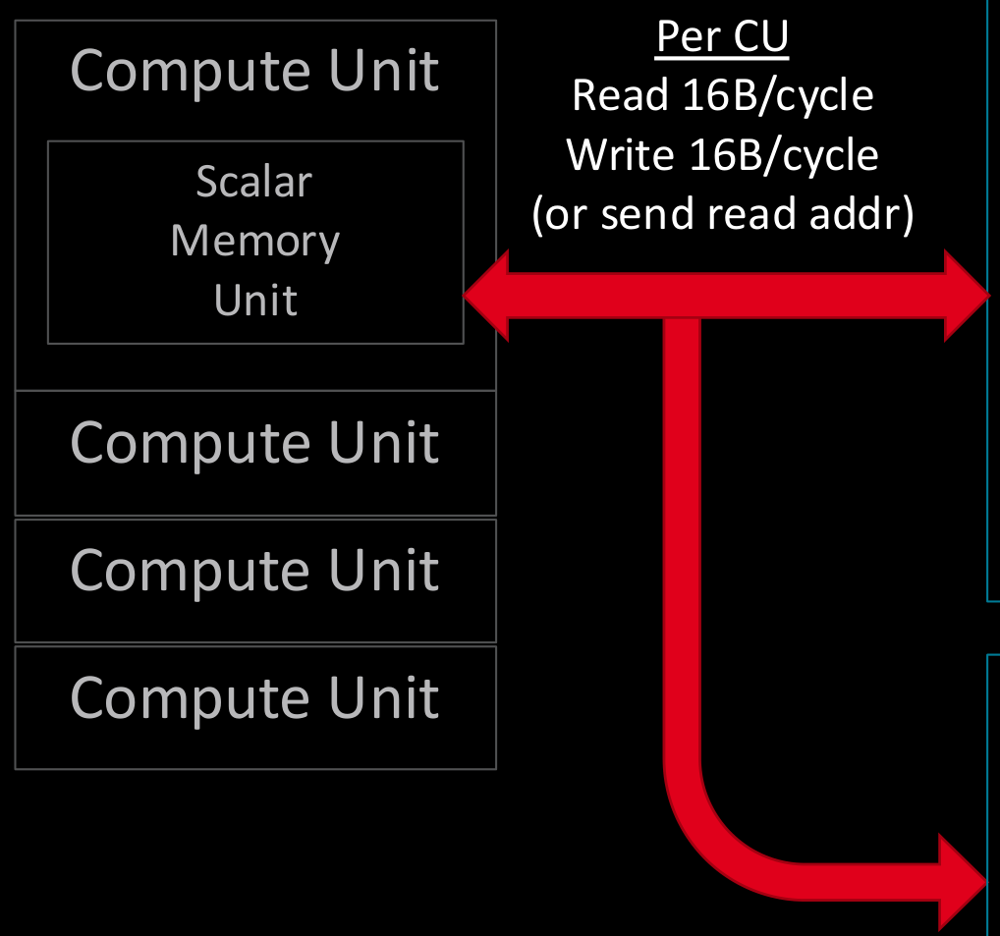
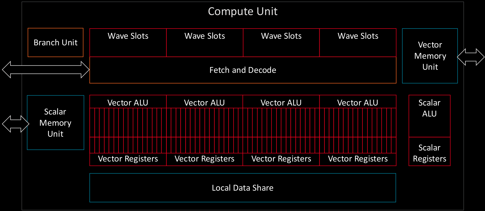
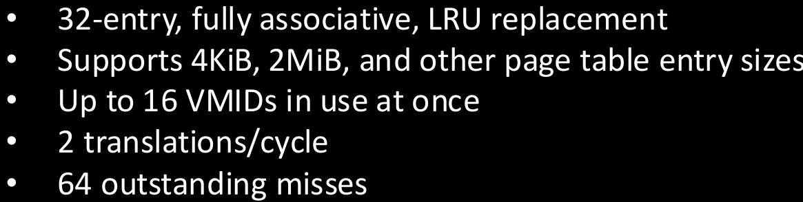

# 2020-04-14 - Memory, IO, and CU Architecture on gfx9 GPUs - Pages 41-50

<!-- Page 41 -->


# On-chip Memory System


<table><tr><td rowspan="8">SE</td><td rowspan="4">SL1+</td><td rowspan="4">L Cache</td><td>CU</td><td>Vector L1 DCache</td></tr><tr><td>CU</td><td>Vector L1 DCache</td></tr><tr><td>CU</td><td>Vector L1 DCache</td></tr><tr><td>CU</td><td>Vector L1 DCache</td></tr><tr><td rowspan="4">SL1+</td><td rowspan="4">L Cache</td><td>CU</td><td>Vector L1 DCache</td></tr><tr><td>CU</td><td>Vector L1 DCache</td></tr><tr><td>CU</td><td>Vector L1 DCache</td></tr><tr><td>CU</td><td>Vector L1 DCache</td></tr></table>

<table><tr><td rowspan="8">SE</td><td rowspan="4">SL1+</td><td rowspan="4">L Cache</td><td>CU</td><td>Vector L1 DCache</td></tr><tr><td>CU</td><td>Vector L1 DCache</td></tr><tr><td>CU</td><td>Vector L1 DCache</td></tr><tr><td>CU</td><td>Vector L1 DCache</td></tr><tr><td rowspan="4">SL1+</td><td rowspan="4">L Cache</td><td>CU</td><td>Vector L1 DCache</td></tr><tr><td>CU</td><td>Vector L1 DCache</td></tr><tr><td>CU</td><td>Vector L1 DCache</td></tr><tr><td>CU</td><td>Vector L1 DCache</td></tr></table>

<table><tr><td>Vector L1 DCache</td><td>CU</td><td rowspan="4">L Cache</td><td rowspan="4">SL1+</td><td rowspan="8">SE</td></tr><tr><td>Vector L1 DCache</td><td>CU</td></tr><tr><td>Vector L1 DCache</td><td>CU</td></tr><tr><td>Vector L1 DCache</td><td>CU</td></tr><tr><td>Vector L1 DCache</td><td>CU</td><td rowspan="4">L Cache</td><td rowspan="4">SL1+</td></tr><tr><td>Vector L1 DCache</td><td>CU</td></tr><tr><td>Vector L1 DCache</td><td>CU</td></tr><tr><td>Vector L1 DCache</td><td>CU</td></tr></table>

<table><tr><td>Vector L1 DCache</td><td>CU</td><td rowspan="4">L Cache</td><td rowspan="4">SL1+</td><td rowspan="8">SE</td></tr><tr><td>Vector L1 DCache</td><td>CU</td></tr><tr><td>Vector L1 DCache</td><td>CU</td></tr><tr><td>Vector L1 DCache</td><td>CU</td></tr><tr><td>Vector L1 DCache</td><td>CU</td><td rowspan="4">L Cache</td><td rowspan="4">SL1+</td></tr><tr><td>Vector L1 DCache</td><td>CU</td></tr><tr><td>Vector L1 DCache</td><td>CU</td></tr><tr><td>Vector L1 DCache</td><td>CU</td></tr></table>

Memory Controllers


HBM/GDDR Memory


---


<!-- Page 42 -->


# One Scalar L1 Data Cache shared by 4 CUs





# Scalar L1 Data Cache


16 KiB Read/Write Data Cache


64B cache lines, 4-way set associative, 4 banks


32 MSHR per bank


- Default: Write-back, write-no-allocate


- If GLC bit is set in SMEM write, write-through + invalidate


- If GLC bit is set in SMEM read, miss to L2 + invalidate


- LRU replacement when not forcing miss


- Non-inclusive of L2 cache


- Virtually indexed, physically tagged


# Scalar L1 DTLB


32-entry, fully associative, LRU replacement


- Supports 4KiB, 2MiB, and other page table entry sizes


- Up to 16 VMIDs in use at once


- 2 translations/cycle


- 64 outstanding misses


---


<!-- Page 43 -->


# AMD GCN Instruction Classes


Vector ALU (VALU): 64-wide ALU instruction.


Vector Memory (VMEM): 64-wide memory instruction.


Local Data Share (LDS): 64-wide memory operations to CU scratchpad.


Scalar ALU (SALU): ALU operation if every thread is working on identical data.


Scalar Memory (SMEM): Identical memory operation in all lanes.


Branch: Used if the entire wavefront wants to branch.


Internal: Wavefront bookkeeping. NOPs, workgroup barriers, wait-for-memory, etc.


---


<!-- Page 44 -->


# Inside a Compute Unit – Branch Unit


# Branch Unit


Unit used specifically to handle wavefront-wide branching.


Per-lane "branching" is handled by changes to the EXEC mask, a 64-bit predicate register.


- If your lane's bit is 0 in the EXEC mask, your VALU and VMEM ops are NOPs.


Arbitrary changes in program counter (e.g. jumps, function calls) handled with branch instructions.


- Similarly, if software sees that all lanes are disabled, it can choose to branch around a region of code.


- This is not handled automatically by the hardware. Requires branch instruction


Unit also used to send messages / interrupts to the host.


---


<!-- Page 45 -->


# Compute Unit Internals


<table><tr><td colspan="5">Compute Unit</td></tr><tr><td>Branch Unit</td><td>Wave Slots</td><td>Wave Slots</td><td>Wave Slots</td><td>Wave Slots</td></tr><tr><td rowspan="3">Scalar Memory Unit</td><td>Vector ALU</td><td>Vector ALU</td><td>Vector ALU</td><td>Vector ALU</td></tr><tr><td>Vector Registers</td><td>Vector Registers</td><td>Vector Registers</td><td>Vector Registers</td></tr><tr><td colspan="4">Local Data Share</td></tr><tr><td></td><td>Scalar ALU</td><td></td><td></td><td></td></tr><tr><td></td><td>Scalar Registers</td><td></td><td></td><td></td></tr></table>


---


<!-- Page 46 -->


# AMD GCN Instruction Classes


Vector ALU (VALU): 64-wide ALU instruction.


Vector Memory (VMEM): 64-wide memory instruction.


Local Data Share (LDS): 64-wide memory operations to CU scratchpad.


Scalar ALU (SALU): ALU operation if every thread is working on identical data.


Scalar Memory (SMEM): Identical memory operation in all lanes.


Branch: Used if the entire wavefront wants to branch.


Internal: Wavefront bookkeeping. NOPs, workgroup barriers, wait-for-memory, etc.


---


<!-- Page 47 -->


# Compute Unit Internals





---


<!-- Page 48 -->


# One L1 Instruction Cache shared by 4 CUs


<table><tr><td>Compute Unit</td></tr><tr><td>Fetch + Decode Unit</td></tr><tr><td>Compute Unit</td></tr><tr><td>Compute Unit</td></tr><tr><td>Compute Unit</td></tr></table>

Per CU Read 32B/cycle


# L1 Instruction Cache


32 KiB Read-only Instruction Cache


64B cache lines, 4-way set associative, 4 banks • 64 MSHR per bank


LRU replacement


Non-inclusive of L2 cache


- Virtually indexed, virtually tagged, entries include VMID
- Only accesses ITLB on cache miss


# L1 ITLB


32-entry, fully associative, LRU replacement


- Supports 4KiB, 2MiB, and other page table entry sizes


- Up to 16 VMIDs in use at once


2 translations/cycle


64 outstanding misses





---


<!-- Page 49 -->


# Inside a Compute Unit – Fetch and Decode Unit


<table><tr><td>Wave Slots #0</td><td>Wave Slots #1</td><td>Wave Slots #2</td><td>Wave Slots #3</td></tr><tr><td colspan="4">Fetch and Decode</td></tr></table>

- Fetch logic only looks at one set of wave slots per cycle. Round robins through them.


- e.g. Looks for wavefronts to run in Wave Slots #0 in cycle 0, Wave Slots #1 in cycle 1, etc.


- Executes all waves in-order, and only executes (at most) 1 instruction/wave at each scheduling interval


- Every cycle, can issue one instruction to each other unit in the CU:


- VALU


- VMEM


- SALU/SMEM


- LDS


- Branch


---


<!-- Page 50 -->


Example of Issuing Multiple Instructions per Cycle


Our example code from earlier:


If we had 5 wavefronts in this wave slot group, each ready to run a different one of the highlighted instructions, we could issue 5 instructions this cycle.


```code
s_load_dwordx4 s[0:3], s[4:5], 0 ← Scalar Memory
v_lshlrev_b64 v[2:3], 2, v[2:3] ← Vector ALU
s_waitcnt lgkmcnt(0)
s_add_u32 s0, 16, s0 ← Scalar ALU
s_addc_u32 s1, 0, s1
v_add_co_u32 v0, s0, v2
v_addc_co_u32 v1, s1, v3
global_load_dword v4, v[0:1] ← Vector Memory
v_add_co_u32 v0, s2, v2
v_addc_co_u32 v1, s3, v3
s_waitcnt vmcnt(0) ← Internal
global_store_dword v[0:1], v4
s_endpgm
```


---


