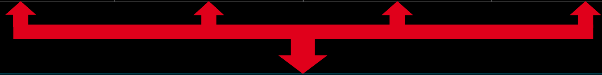

# 2020-04-14 - Memory, IO, and CU Architecture on gfx9 GPUs - Pages 51-60

<!-- Page 51 -->

# Inside a Compute Unit – Fetch and Decode Unit

<table><tr><td>Wave Slots #0</td><td>Wave Slots #1</td><td>Wave Slots #2</td><td>Wave Slots #3</td></tr><tr><td colspan="4">Fetch and Decode</td></tr></table>

- If there are multiple ready wavefronts vying for the same resource, fetch priority:

- Normally: oldest ready wave first.

- Can be overridden by S_SET prio instruction: set your wavefront's priority higher or lower.

- Hardware also overrides this logic for "soft clauses" of memory operations.

- HW tries to issue consecutive memory operations back-to-back to increase memory system efficiency.

- Alternate way to read this: try to "bunch up" your memory operations in your applications.

"Internal" operations:

- Wavefront stall, priority operations like S_NOP, S_SLEEP, S_SET prio

- Waiting for memory accesses to complete: S_WAITCNT

- Waiting at workgroup-wide barrier: S_BARRIER

- 16 hardware workgroup-wide barriers in each CU; limits us to 16 >1-wave workgroups.

---

<!-- Page 52 -->

# Compute Unit Internals

---

<!-- Page 53 -->

# On-chip Memory System

<table><tr><td rowspan="8">SE</td><td rowspan="4">SL1+</td><td rowspan="4">L Cache</td><td>CU</td><td>Vector L1 DCache</td></tr><tr><td>CU</td><td>Vector L1 DCache</td></tr><tr><td>CU</td><td>Vector L1 DCache</td></tr><tr><td>CU</td><td>Vector L1 DCache</td></tr><tr><td rowspan="4">SL1+</td><td rowspan="4">L Cache</td><td>CU</td><td>Vector L1 DCache</td></tr><tr><td>CU</td><td>Vector L1 DCache</td></tr><tr><td>CU</td><td>Vector L1 DCache</td></tr><tr><td>CU</td><td>Vector L1 DCache</td></tr></table>

<table><tr><td>Vector L1 DCache</td><td>CU</td><td rowspan="4">L Cache</td><td rowspan="4">SL1+</td><td rowspan="8">SE</td></tr><tr><td>Vector L1 DCache</td><td>CU</td></tr><tr><td>Vector L1 DCache</td><td>CU</td></tr><tr><td>Vector L1 DCache</td><td>CU</td></tr><tr><td>Vector L1 DCache</td><td>CU</td><td rowspan="4">L Cache</td><td rowspan="4">SL1+</td></tr><tr><td>Vector L1 DCache</td><td>CU</td></tr><tr><td>Vector L1 DCache</td><td>CU</td></tr><tr><td>Vector L1 DCache</td><td>CU</td></tr></table>

<table><tr><td rowspan="8">SE</td><td rowspan="4">SL1+</td><td rowspan="4">L Cache</td><td>CU</td><td>Vector L1 DCache</td></tr><tr><td>CU</td><td>Vector L1 DCache</td></tr><tr><td>CU</td><td>Vector L1 DCache</td></tr><tr><td>CU</td><td>Vector L1 DCache</td></tr><tr><td rowspan="4">SL1+</td><td rowspan="4">L Cache</td><td>CU</td><td>Vector L1 DCache</td></tr><tr><td>CU</td><td>Vector L1 DCache</td></tr><tr><td>CU</td><td>Vector L1 DCache</td></tr><tr><td>CU</td><td>Vector L1 DCache</td></tr></table>

<table><tr><td>Vector L1 DCache</td><td>CU</td><td rowspan="4">L Cache</td><td rowspan="4">SL1+</td><td rowspan="8">SE</td></tr><tr><td>Vector L1 DCache</td><td>CU</td></tr><tr><td>Vector L1 DCache</td><td>CU</td></tr><tr><td>Vector L1 DCache</td><td>CU</td></tr><tr><td>Vector L1 DCache</td><td>CU</td><td rowspan="4">L Cache</td><td rowspan="4">SL1+</td></tr><tr><td>Vector L1 DCache</td><td>CU</td></tr><tr><td>Vector L1 DCache</td><td>CU</td></tr><tr><td>Vector L1 DCache</td><td>CU</td></tr></table>

Read/Write L2 Cache

Memory Controllers

HBM/GDDR Memory

---

<!-- Page 54 -->

# On-chip Memory System

<table><tr><td rowspan="10">SE</td><td rowspan="5">SL1+</td><td rowspan="5">L Cache</td><td>CU</td><td>Vector L1 DCache</td><td rowspan="20">Logical Crossbar Interconnect</td><td>Vector L1 DCache</td><td>CU</td><td rowspan="5">L Cache</td><td rowspan="5">SL1+</td><td rowspan="10">SE</td></tr><tr><td>CU</td><td>Vector L1 DCache</td><td>Vector L1 DCache</td><td>CU</td></tr><tr><td>CU</td><td>Vector L1 DCache</td><td>Vector L1 DCache</td><td>CU</td></tr><tr><td>CU</td><td>Vector L1 DCache</td><td>Vector L1 DCache</td><td>CU</td></tr><tr><td>CU</td><td>Vector L1 DCache</td><td>Vector L1 DCache</td><td>CU</td></tr><tr><td rowspan="5">SL1+</td><td rowspan="5">L Cache</td><td>CU</td><td>Vector L1 DCache</td><td>Vector L1 DCache</td><td>CU</td><td rowspan="5">L Cache</td><td rowspan="5">SL1+</td></tr><tr><td>CU</td><td>Vector L1 DCache</td><td>Vector L1 DCache</td><td>CU</td></tr><tr><td>CU</td><td>Vector L1 DCache</td><td>Vector L1 DCache</td><td>CU</td></tr><tr><td>CU</td><td>Vector L1 DCache</td><td>Vector L1 DCache</td><td>CU</td></tr><tr><td>CU</td><td>Vector L1 DCache</td><td>Vector L1 DCache</td><td>CU</td></tr><tr><td rowspan="10">SE</td><td rowspan="5">SL1+</td><td rowspan="5">L Cache</td><td>CU</td><td>Vector L1 DCache</td><td rowspan="20">· Clients (e.g., CUs) cannot talk to one another directly</td><td>Vector L1 DCache</td><td>CU</td><td rowspan="5">L Cache</td><td rowspan="5">SL1+</td><td rowspan="10">SE</td></tr><tr><td>CU</td><td>Vector L1 DCache</td><td>Vector L1 DCache</td><td>CU</td></tr><tr><td>CU</td><td>Vector L1 DCache</td><td>Vector L1 DCache</td><td>CU</td></tr><tr><td>CU</td><td>Vector L1 DCache</td><td>Vector L1 DCache</td><td>CU</td></tr><tr><td>CU</td><td>Vector L1 DCache</td><td>Vector L1 DCache</td><td>CU</td></tr><tr><td rowspan="5">SL1+</td><td rowspan="5">L Cache</td><td>CU</td><td>Vector L1 DCache</td><td>Vector L1 DCache</td><td>CU</td><td rowspan="5">L Cache</td><td rowspan="5">SL1+</td></tr><tr><td>CU</td><td>Vector L1 DCache</td><td>Vector L1 DCache</td><td>CU</td></tr><tr><td>CU</td><td>Vector L1 DCache</td><td>Vector L1 DCache</td><td>CU</td></tr><tr><td>CU</td><td>Vector L1 DCache</td><td>Vector L1 DCache</td><td>CU</td></tr><tr><td>CU</td><td>Vector L1 DCache</td><td>Vector L1 DCache</td><td>CU</td></tr></table>

---

<!-- Page 55 -->

# Shared L2 Cache is a Coherence Point for Graphics Clients

# L2 Cache (TCC)

16-way set associative

64B lines (128B in MI-200)

Write-back, write allocate

- Default: LRU replacement policy

- Possible to insert misses at LRU (e.g. SLC bit in VMEM ops)

- Physically indexed, physically tagged

- Supports atomic operations:

- Vega 10, Vega 20: Integer and logical

- MI100: FP32 and FP16 add

- MI200: FP64 add

<table><tr><td></td><td>Vega 10</td><td>Vega 20</td><td>MI100</td><td>MI200</td></tr><tr><td>L2 Cache Size</td><td>4 MiB</td><td>4 MiB</td><td>8 MiB</td><td>8 MiB</td></tr><tr><td>Per-channel</td><td>64B/cycle read</td><td>64B/cycle read</td><td>64B/cycle read</td><td>128B/cycle read</td></tr><tr><td>L2 Bandwidth</td><td>64B/cycle write</td><td>64B/cycle write</td><td>64B/cycle write</td><td>64B/cycle write</td></tr></table>

256B Channel Interleaving

Vega 10, Vega 20: 16 channels MI100, MI200: 32 channels

L2 Channel

Normally: 1 EA per L2 Channel

Vega 20: 2 EA per channel

32 B/cycle each direction

MI-200: 64 B/cycle

Efficiency Arbiter

---

<!-- Page 56 -->

# Shared L2 TLB for Graphics Core Clients

Description for "GPUVM" page tables; IOMMU-based virtualization uses further ATC translations

<table><tr><td>Compute Units’
vL1 DTLBs</td><td>Compute Units’
sL1 DTLBs</td><td>Compute Units’
L1 ITLBs</td><td>Command
Processor TLBs</td></tr></table>

# L2 TLB

# 4 KiB Pages

4096 entries (16,384 in MI200)

- 2-way set associative, 4 banks (8 in MI200)

- LRU replacement

- 4 translations / cycle (8 in MI200)

None

# 2 MiB Pages

32,768 entries

- 2-way set associative, 4 banks (8 in MI200)

- LRU replacement

- 4 translations / cycle (8 in MI200)

None

# Page Table Walker

- 2048-, 1024-, and 512-entry caches for page directory entries

- Parallel lookups into each cache, 1 per cache per cycle

- One request to memory per clock, up to 128 in flight

None

# L2 Cache

---

<!-- Page 57 -->

# GPU Memory System – Getting Off Chip

---

<!-- Page 58 -->

# On-chip Memory System

<table><tr><td rowspan="4">SE</td><td rowspan="4">L1+1 Cache</td><td>CU</td><td>Vector L1 DCache</td><td rowspan="4">Logical Crossbar Interconnect</td><td>Vector L1 DCache</td><td>CU</td><td rowspan="4">L1 Cache</td><td rowspan="4">L1+1</td><td rowspan="4">SE</td></tr><tr><td>CU</td><td>Vector L1 DCache</td><td>Vector L1 DCache</td><td>CU</td></tr><tr><td>CU</td><td>Vector L1 DCache</td><td>Vector L1 DCache</td><td>CU</td></tr><tr><td>CU</td><td>Vector L1 DCache</td><td>Vector L1 DCache</td><td>CU</td></tr></table>

Read/Write L2 Cache

Efficiency Arbiters

Memory Controllers

HBM/GDDR Memory

---

<!-- Page 59 -->

# Efficiency Arbiters Order Accesses to Memory and Off-Chip Buses

32 B/cycle each direction MI-200: 64 B/cycle

# Efficiency Arbiter

- Buffers requests to memory, PCIe®, and xGMI

- Reorders commands to increase access efficiency

- Different internal policies for each target type

- e.g., DRAM reordering different than xGMI reordering

32 B/cycle each direction MI-200: 64 B/cycle

SOC Routing Network

---

<!-- Page 60 -->

# On-chip Memory System

<table><tr><td rowspan="4">SE</td><td rowspan="4">L1+1 Cache</td><td>CU</td><td>Vector L1 DCache</td><td rowspan="4">Logical Crossbar Interconnect</td><td>Vector L1 DCache</td><td>CU</td><td rowspan="4">L1 Cache</td><td rowspan="4">L1+1</td><td rowspan="4">SE</td></tr><tr><td>CU</td><td>Vector L1 DCache</td><td>Vector L1 DCache</td><td>CU</td></tr><tr><td>CU</td><td>Vector L1 DCache</td><td>Vector L1 DCache</td><td>CU</td></tr><tr><td>CU</td><td>Vector L1 DCache</td><td>Vector L1 DCache</td><td>CU</td></tr></table>

Read/Write L2 Cache

Efficiency Arbiters

SOC Routing Network

PCIe® Controllers

Memory Controllers

xGMI Controllers

PCIe® Links

HBM/GDDR Memory

xGMI Links

---

